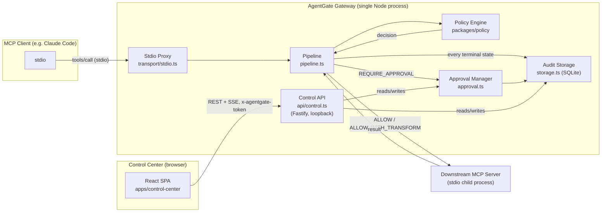
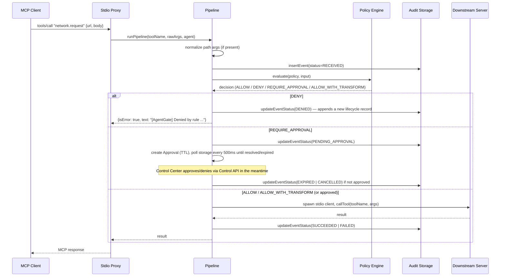
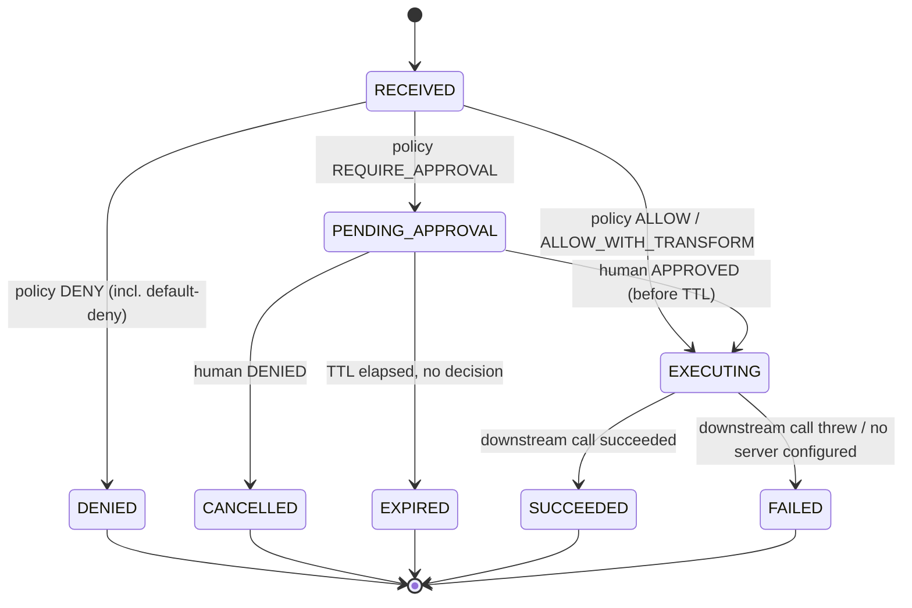
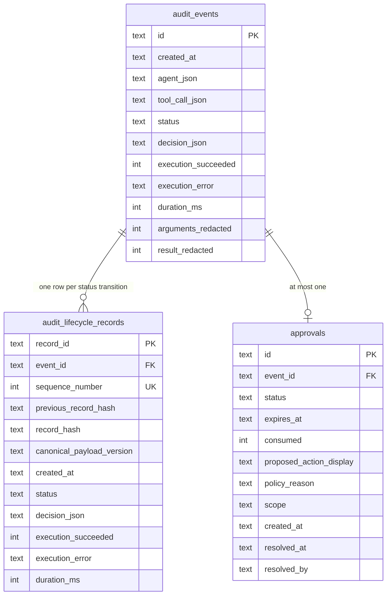
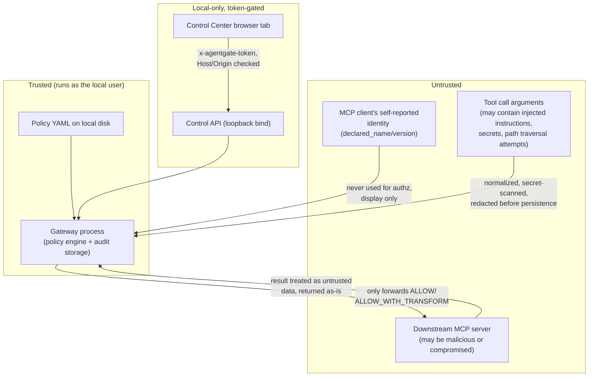

# Architecture

This document describes AgentGate as implemented today. Every diagram is drawn from the code cited beside it —
where the two disagree, the code is correct and this file is stale; please file an issue.

## Components

| Component | Responsibility | Code |
|---|---|---|
| **Stdio proxy** | Speaks MCP to the upstream client (e.g. Claude Code) as a *server*, and to the downstream MCP server as a *client*. Intercepts every `tools/call`. | `packages/gateway/src/transport/stdio.ts` |
| **Pipeline** | Normalizes arguments, redacts for audit, evaluates policy, executes (or blocks), records the terminal event. Never throws — errors become `FAILED` audit events. | `packages/gateway/src/pipeline.ts` |
| **Policy engine** | Parses/validates policy YAML (Zod schema), evaluates first-match rules, normalizes paths, detects secrets. | `packages/policy/src/{schema,engine,transformation,index}.ts` |
| **Downstream registry** | Parses gateway config, resolves which configured downstream server owns a given tool name. | `packages/gateway/src/config/registry.ts` |
| **Approval manager** | Creates/approves/denies/expires human-in-the-loop approvals; single-use; TTL-bound; polling-based expiry (10s interval). | `packages/gateway/src/approval.ts` |
| **Audit storage** | SQLite-backed, hash-chained, append-only audit log plus approvals/agents tables. | `packages/gateway/src/storage.ts` |
| **Control API** | Loopback-only Fastify REST + SSE API behind a per-launch random token. | `packages/gateway/src/api/control.ts` |
| **Control Center** | React/Vite SPA consuming the Control API. | `apps/control-center/src/**` |
| **Protocol package** | Shared TypeScript types for events, decisions, and the Control API contract — the only cross-package dependency all three consumers share. | `packages/protocol/src/{events,api}.ts` |
| **CLI** | `agentgate start`/`validate`/`audit verify`. | `packages/gateway/src/cli.ts` |

## System diagram

## End-to-end tool-call sequence

Every branch appends to the audit chain — even `DENIED` and `EXPIRED` calls are recorded, never silently dropped.

## Allow / deny / approval lifecycle

`RECEIVED`/`NORMALIZED`/`EVALUATED`/`ALLOWED`/`ALLOWED_WITH_TRANSFORM` are additional `AuditEventStatus` values
defined in `packages/protocol/src/events.ts` for forward compatibility; the current pipeline (`pipeline.ts`) moves
directly from `RECEIVED` to a terminal state without persisting every intermediate status as a separate event —
only `RECEIVED` and the final state are written for the ALLOW path today.

## Audit lifecycle data model

Two tables, by design (see [ADR-0004](AI_DECISIONS.md)):

- `audit_events` is a **mutable projection** — `UPDATE`d in place so the API can cheaply read "the current state of
  event X" — but every state transition is *also* appended as an immutable row in `audit_lifecycle_records`
  (`storage.ts` `appendLifecycleRecord()`), which is where the actual append-only guarantee lives.
- Each lifecycle record's `record_hash` is `sha256(canonicalize({record_id, event_id, sequence_number,
  previous_record_hash, created_at, status, decision_type, execution_succeeded, execution_error, duration_ms,
  agent_session_id, tool, normalized_arguments}))`, where `canonicalize()` recursively sorts object keys before
  stringifying so the hash is stable regardless of JS property-insertion order.
- `AuditStorage.verifyChain()` re-walks every `audit_lifecycle_records` row in `sequence_number` order, checks the
  sequence has no gaps, recomputes each hash from the row's own data plus the *stored* `previous_record_hash`, and
  fails on the first mismatch. This is what `agentgate audit verify` and the demo call.

## Trust boundaries

The gateway process itself runs with the same OS privileges as the user who started it — AgentGate is a policy and
audit layer, not a sandbox. It cannot stop a downstream server from doing something outside the tool-call interface
it exposes.

## Local API boundary

The Control API (`packages/gateway/src/api/control.ts`) is defensive-in-depth for a *local, single-user* tool, not
a general-purpose auth system:

1. **Bind**: `127.0.0.1` only (`server.ts` `controlApp.listen({ host: '127.0.0.1' })`) — never `0.0.0.0`.
2. **Host header allowlist**: only `localhost` / `127.0.0.1` / `[::1]` / `::1` accepted; anything else → `403`.
3. **Origin allowlist** (when present): same loopback set, else `403` — defends against a malicious page in another
   browser tab issuing cross-origin requests (a DNS-rebinding-style attack still needs a `Host` header AgentGate
   trusts, which is why the Host check exists independently of Origin).
4. **CORS**: `@fastify/cors` restricted to the Vite dev server origins (`http://127.0.0.1:5173`,
   `http://localhost:5173`).
5. **Token**: a fresh 32-byte random hex token per gateway launch, required as `x-agentgate-token` on every request
   except the SSE stream, which accepts it as a `?token=` query parameter (`EventSource` cannot set custom headers).
6. **`Referrer-Policy: no-referrer`** on every response.
7. **Confused-deputy check** on approve: the request body's `event_id` must match the approval's actual `event_id`
   before an approval can be granted.

See [`docs/THREAT_MODEL.md`](THREAT_MODEL.md) for what this boundary does *not* cover (e.g. the SSE token appearing
in browser history/logs, since it must be a query parameter).

## Failure modes

- **Malformed policy file**: `loadPolicyFile()`/`validatePolicy()` throw with structured errors. `runPipeline()`
  calls `loadPolicyFile()` *before* it records the `RECEIVED` audit event and does not catch the throw itself —
  the call is neither recorded nor safely denied at the pipeline level; it propagates to the MCP SDK's own request
  handler, which converts it into a generic JSON-RPC error back to the client. There is no audit record and no
  `MALFORMED_POLICY` decision produced for this path today, despite `ReasonCode` defining one. Documented as a
  known gap in [`docs/THREAT_MODEL.md`](THREAT_MODEL.md).
- **Downstream server unreachable/crashes**: `executeDownstream()` catches the error and the event is recorded as
  `FAILED` with the (untrusted, unredacted-by-default) error message — see
  [`docs/THREAT_MODEL.md`](THREAT_MODEL.md#log-and-audit-poisoning) for why that message is not currently secret-scanned.
- **No downstream server configured for a tool**: recorded as `FAILED` with an explicit error, not silently
  dropped.
- **Approval never answered**: expires at TTL, recorded as `EXPIRED`, single background sweep
  (`ApprovalManager.expireStale()`, every 10s) also marks stale `PENDING` rows `EXPIRED` independently of any
  in-flight `runPipeline()` call.
- **Gateway process killed mid-call**: SQLite writes inside `appendLifecycleRecord()` are wrapped in a
  `this.db.transaction()`, so a crash mid-write cannot leave a partially-written lifecycle record; a call in
  flight simply never reaches a terminal audit state.

## Extension points

- **New downstream transport**: `DownstreamServerSchema` in `config/registry.ts` already has an `HttpServerSchema`
  branch; `pipeline.ts` `executeDownstream()` would need an HTTP-client branch to actually use it (see
  [Protocol limitations](#protocol-limitations)).
- **New policy match fields**: add to `PolicyRuleSchema` (`packages/policy/src/schema.ts`) and to `ruleMatches()`
  (`packages/policy/src/engine.ts`); both are small, well-isolated functions.
- **New secret pattern**: append a `RegExp` to `SECRET_PATTERNS` in `packages/policy/src/transformation.ts`.
- **New Control API endpoint**: add a route in `buildControlApi()`; the `onRequest` hook already applies
  Host/Origin/token checks to every route registered afterward.

## Protocol limitations

- Only **legacy 2025-era MCP over stdio** is implemented end-to-end, on both the upstream (client-facing) and
  downstream (server-facing) sides — see [ADR-0005](AI_DECISIONS.md). `McpEra` already models a `'modern-2026-07-28'`
  value in `packages/protocol/src/events.ts`, but the pipeline hardcodes `'legacy-2025'`
  (`packages/gateway/src/transport/stdio.ts`).
- Downstream tool **discovery** connects a short-lived MCP client to the first configured stdio server and calls
  `listTools()`; if that server is unreachable at gateway startup, the proxy still starts but advertises an empty
  tool list upstream (tool calls by name still work — the pipeline does not consult the discovered list before
  evaluating a call).
- Each downstream tool call spawns a **fresh stdio client connection** rather than reusing a pooled one
  (`executeDownstream()` — explicitly noted in-code as a Milestone 1 simplification).
