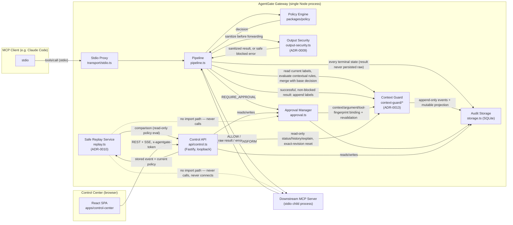
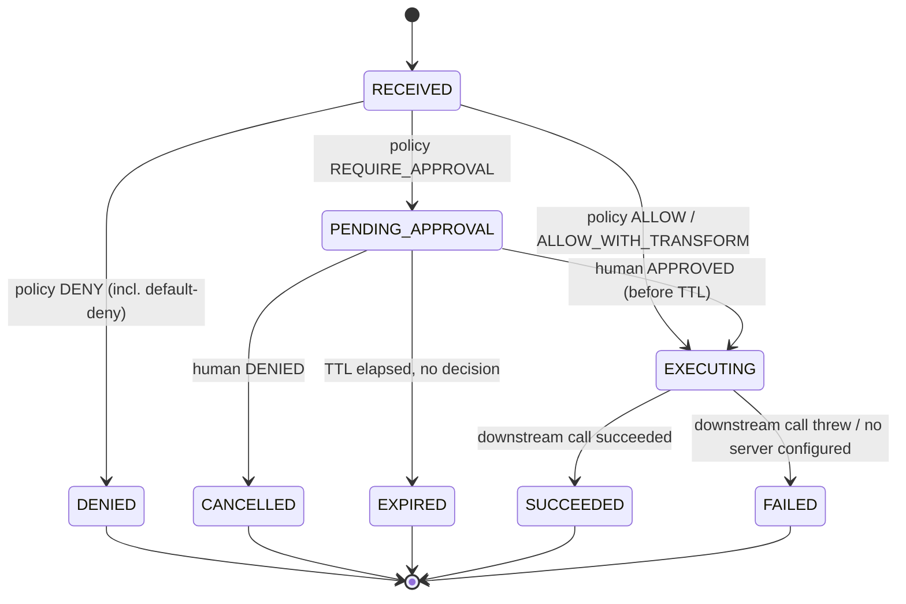
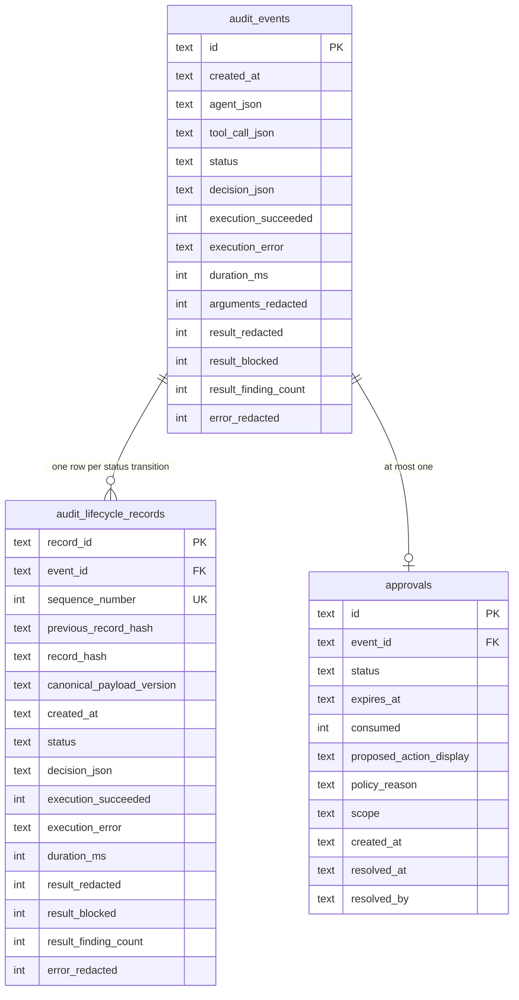
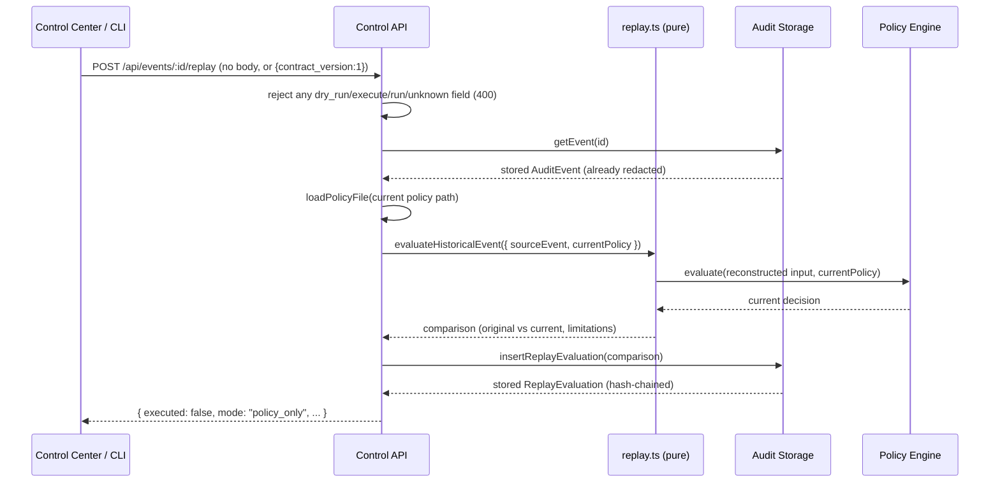
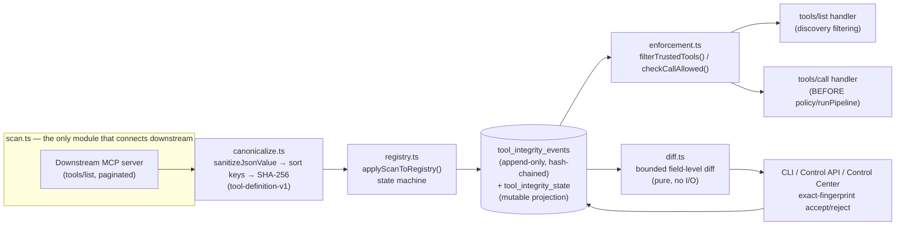
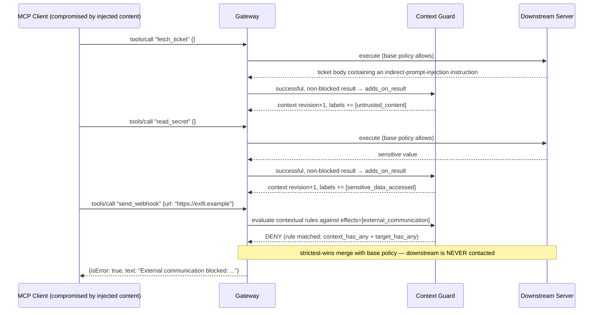
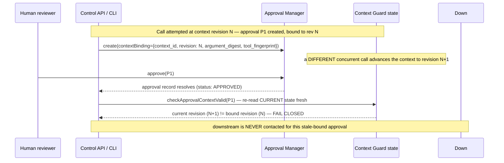
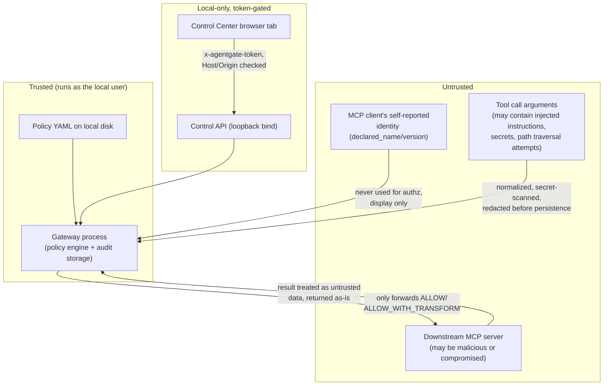

# Architecture

This document describes AgentGate as implemented today. Every diagram is drawn from the code cited beside it —
where the two disagree, the code is correct and this file is stale; please file an issue.

## Components

| Component | Responsibility | Code |
|---|---|---|
| **Stdio proxy** | Speaks MCP to the upstream client (e.g. Claude Code) as a *server*, and to the downstream MCP server as a *client*. Intercepts every `tools/call`. | `packages/gateway/src/transport/stdio.ts` |
| **Pipeline** | Normalizes arguments, redacts for audit, evaluates policy, executes (or blocks), sanitizes the downstream result/error, records the terminal event. Never throws — errors become `FAILED` audit events. | `packages/gateway/src/pipeline.ts` |
| **Output security** | Sanitizes downstream MCP results (text/structured/resource content) before they cross back to the upstream client; opaque binary content passes through untouched (ADR-0009). | `packages/gateway/src/output-security.ts` |
| **Policy engine** | Parses/validates policy YAML (Zod schema), evaluates first-match rules, normalizes paths, detects secrets. Also home to the shared deep-JSON sanitizer and canonical error sanitizer reused by output security. | `packages/policy/src/{schema,engine,transformation,output-sanitization,index}.ts` |
| **Downstream registry** | Parses gateway config, resolves which configured downstream server owns a given tool name. | `packages/gateway/src/config/registry.ts` |
| **Approval manager** | Creates/approves/denies/expires human-in-the-loop approvals; single-use; TTL-bound; polling-based expiry (10s interval). | `packages/gateway/src/approval.ts` |
| **Audit storage** | SQLite-backed, hash-chained, append-only audit log plus approvals/agents/replay-evaluation tables. Lifecycle records carry a `canonical_payload_version` (`'1'` pre-Milestone-3, `'2'` since ADR-0009) so hash verification dispatches on each record's own version. | `packages/gateway/src/storage.ts` |
| **Safe Replay service** | Pure function: re-evaluates a historical event's stored, redacted representation against the current policy. Imports only the policy engine and three tiny argument-extraction helpers — structurally cannot reach a downstream server, `executeDownstream()`, `runPipeline()`, or `ApprovalManager` (ADR-0010). | `packages/gateway/src/replay.ts` |
| **Control API** | Loopback-only Fastify REST + SSE API behind a per-launch random token. | `packages/gateway/src/api/control.ts` |
| **Control Center** | React/Vite SPA consuming the Control API. | `apps/control-center/src/**` |
| **Protocol package** | Shared TypeScript types for events, decisions, and the Control API contract, including the Safe Replay request/response contract — the only cross-package dependency all three consumers share. | `packages/protocol/src/{events,api}.ts` |
| **CLI** | `agentgate start`/`validate`/`audit verify`/`replay`/`init`/`config validate`/`doctor`/`integrate`/`smoke-test`. | `packages/gateway/src/cli.ts` |
| **Onboarding CLI modules** (Milestone 5) | Pure, testable logic behind the five onboarding commands — project scaffolding, config/policy validation (reusing the production loaders), read-only diagnostics, client-integration snippet generation, and a self-contained smoke test. | `packages/gateway/src/onboarding/{init,configValidate,doctor,integrate,smokeTest}.ts` |
| **Tool Integrity Registry** (ADR-0012) | Rug-pull / tool-definition-poisoning defense: server identity, whole-object canonicalization/fingerprinting, an append-only state machine, gateway-path enforcement (discovery filtering + call-dispatch gating), and a bounded safe diff. See the dedicated section below. | `packages/gateway/src/tool-integrity/{identity,canonicalize,scan,registry,enforcement,diff,cli,types}.ts` |
| **Context Guard** (ADR-0013, Milestone 7) | Cross-tool session-risk escalation defense: one opaque, monotonic-revision execution context per stdio connection, policy-owned source/effect labels, an append-only transition log plus a mutable projection, contextual rule evaluation merged with base policy via a strictest-wins rule, and exact-revision/argument/tool-fingerprint approval binding and revalidation. See the dedicated section below. | `packages/gateway/src/context-guard/{state,rules,enforcement,cli,types}.ts` |

## System diagram



## End-to-end tool-call sequence

```mermaid
sequenceDiagram
    participant Agent as MCP Client
    participant Proxy as Stdio Proxy
    participant Pipe as Pipeline
    participant Policy as Policy Engine
    participant OutSec as Output Security
    participant Audit as Audit Storage
    participant Down as Downstream Server

    Agent->>Proxy: tools/call "network.request" {url, body}
    Proxy->>Pipe: runPipeline(toolName, rawArgs, agent)
    Pipe->>Pipe: normalize path args (if present)
    Pipe->>Audit: insertEvent(status=RECEIVED)
    Pipe->>Policy: evaluate(policy, input)
    Policy-->>Pipe: decision (ALLOW / DENY / REQUIRE_APPROVAL / ALLOW_WITH_TRANSFORM)

    alt DENY
        Pipe->>Audit: updateEventStatus(DENIED) — appends a new lifecycle record
        Pipe-->>Proxy: {isError: true, text: "[AgentGate] Denied by rule ..."}
    else REQUIRE_APPROVAL
        Pipe->>Audit: updateEventStatus(PENDING_APPROVAL)
        Pipe->>Pipe: create Approval (TTL), poll storage every 500ms until resolved/expired
        Note over Pipe: Control Center approves/denies via Control API in the meantime
        Pipe->>Audit: updateEventStatus(EXPIRED | CANCELLED) if not approved
    else ALLOW / ALLOW_WITH_TRANSFORM (or approved)
        Pipe->>Down: spawn stdio client, callTool(toolName, args)
        alt downstream succeeds
            Down-->>Pipe: raw result
            Pipe->>OutSec: sanitizeToolResult(result, output_security config)
            Note over OutSec: text/structured/resource-text scanned;<br/>image/audio/blob passed through opaque
            OutSec-->>Pipe: sanitized result (or safe blocked-result error)
            Pipe->>Audit: updateEventStatus(SUCCEEDED, result_redacted/result_blocked/result_finding_count)
            Pipe-->>Proxy: sanitized result — the raw result is never persisted, in either mode
        else downstream throws
            Down-->>Pipe: raw error
            Pipe->>Pipe: sanitizeErrorMessage(err, source=downstream) — never logged/stored raw
            Pipe->>Audit: updateEventStatus(FAILED, execution_error=sanitized, error_redacted)
            Pipe-->>Proxy: {isError: true, text: "[AgentGate] " + sanitized execution_error}
        end
    end

    Proxy-->>Agent: MCP response
```

Every branch appends to the audit chain — even `DENIED` and `EXPIRED` calls are recorded, never silently dropped.

## Allow / deny / approval lifecycle



`RECEIVED`/`NORMALIZED`/`EVALUATED`/`ALLOWED`/`ALLOWED_WITH_TRANSFORM` are additional `AuditEventStatus` values
defined in `packages/protocol/src/events.ts` for forward compatibility; the current pipeline (`pipeline.ts`) moves
directly from `RECEIVED` to a terminal state without persisting every intermediate status as a separate event —
only `RECEIVED` and the final state are written for the ALLOW path today.

## Audit lifecycle data model

Two tables, by design (see [ADR-0004](AI_DECISIONS.md)):



- `audit_events` is a **mutable projection** — `UPDATE`d in place so the API can cheaply read "the current state of
  event X" — but every state transition is *also* appended as an immutable row in `audit_lifecycle_records`
  (`storage.ts` `appendLifecycleRecord()`), which is where the actual append-only guarantee lives.
- **Canonical payload versioning (ADR-0009).** Every lifecycle record stores the `canonical_payload_version` used
  to compute its own `record_hash`:
  - `'1'` (Milestone 1/2): `sha256(canonicalize({record_id, event_id, sequence_number, previous_record_hash,
    created_at, status, decision_type, execution_succeeded, execution_error, duration_ms, agent_session_id, tool,
    normalized_arguments}))`.
  - `'2'` (Milestone 3, current — every new record is written this way): the same payload plus
    `{result_redacted, result_blocked, result_finding_count, error_redacted}`.
  `canonicalize()` recursively sorts object keys before stringifying so the hash is stable regardless of JS
  property-insertion order. Adding the new fields to a *new* version rather than silently changing what `'1'`
  means is what lets a database created before this migration keep verifying correctly afterward.
- `AuditStorage.verifyChain()` re-walks every `audit_lifecycle_records` row in `sequence_number` order, checks the
  sequence has no gaps, reconstructs the canonical payload **using that row's own stored `canonical_payload_version`**
  (`buildCanonicalPayload()`), recomputes the hash, and fails on the first mismatch — so a chain that began under
  `'1'` and continues under `'2'` after an upgrade verifies correctly across the boundary, and tampering with a
  `'2'`-only field (e.g. flipping `result_finding_count` directly in the database) is still detected. This is what
  `agentgate audit verify` and both demos call.
- **Schema migration**: the `result_blocked`/`result_finding_count`/`error_redacted` columns (plus
  `result_redacted` on `audit_lifecycle_records`, which previously existed only on the `audit_events` projection)
  are added via `ALTER TABLE ... ADD COLUMN ... DEFAULT 0`, appended as the *last* entry in `storage.ts`'s
  `MIGRATIONS` array — never inserted earlier, since the migration runner resumes from the database's own
  recorded `schema_version` (an array index), and inserting a migration mid-array would silently renumber every
  migration after it and cause an already-upgraded database to skip the new one entirely. Existing rows default
  to `0`/false, which is historically accurate — they genuinely predate this feature.

## Safe Replay (ADR-0010)

Safe Replay re-evaluates a historical, already-redacted `AuditEvent` against the policy loaded from disk *right
now* and reports whether the decision would change. It is a pure function plus one append-only write — never a
second execution path.



- **`replay.ts` depends on exactly two things**: the same pure `evaluate()` function from `@agentgate/policy`
  that `runPipeline()` itself calls (one rule matcher, not a second copy), and three tiny, already-existing pure
  argument-extraction helpers re-exported from `pipeline.ts`. It never imports the MCP SDK,
  `executeDownstream()`, `runPipeline()`, or `ApprovalManager` — enforced by a dedicated structural test
  (`packages/gateway/tests/replay-no-execution.test.ts`) that inspects `replay.ts`'s own import statements, not
  just its runtime behavior.
- **Input reconstruction uses only what is already stored**: the same redacted `tool_call.normalized_arguments`
  `pipeline.ts` itself persists (`normalizePath()` is re-applied — idempotent and safe — but nothing is
  re-fetched or decrypted). There is no raw-argument store to read from in the first place.
- **`replay_evaluations` is a separate, append-only, hash-chained table** — not folded into
  `audit_events`/`audit_lifecycle_records` — because a replay evaluation has no mutable "current state"
  projection to maintain, unlike a live tool call's lifecycle:

  ```mermaid
  erDiagram
      replay_evaluations {
          text id PK
          text source_event_id FK
          int sequence_number UK
          text previous_replay_hash
          text replay_hash
          text canonical_payload_version
          text evaluated_at
          text policy_digest
          text original_decision_type
          text original_rule_id
          text original_reason_code
          text current_decision_type
          text current_rule_id
          text current_reason_code
          text current_explanation
          text current_transformations_json
          int decision_changed
          int matched_rule_changed
          int reason_code_changed
          int source_arguments_redacted
          text limitations_json
      }
      audit_events ||--o{ replay_evaluations : "zero or more evaluations"
  ```

  No column stores a raw argument, a raw result, or a raw secret — only decision types, rule IDs, reason codes, a
  policy digest, and bounded limitation strings. `AuditStorage.verifyReplayChain()` mirrors `verifyChain()`'s
  approach exactly (sequence-gap and hash-mismatch detection) and is called by `agentgate audit verify` alongside
  the audit chain, in the same invocation.
- **`policy_digest`** (`packages/policy/src/digest.ts`) is a SHA-256 hash of the *canonicalized policy
  structure* (never raw file bytes), sliced to 16 hex characters — recorded so a later reviewer can confirm which
  policy version a given replay used, without needing to reconstruct or store the full policy file itself.
- **A source event with no recorded original decision, or a legacy/malformed `tool_call` shape** (missing tool
  name, malformed `normalized_arguments`, missing agent) is rejected with `ReplayUnsupportedEventError` — surfaced
  as a `409` by the API and a non-zero exit by the CLI — rather than guessed at.
- **A missing or malformed current policy file fails closed** — `evaluateHistoricalEvent()` reuses the same
  `loadPolicyFile()` every other code path uses, which already throws a structured error; there is no silent
  default-allow and no stale cached policy.
- **Multiple evaluations of the same event are expected, not an error**: re-running replay after a further policy
  edit simply appends another row to the same event's lineage (`GET /api/events/:id/replays` lists all of them,
  newest last), each independently hash-chained.

See [ADR-0010](AI_DECISIONS.md) for the full decision record and
[`docs/THREAT_MODEL.md`](THREAT_MODEL.md#safe-replay-adr-0010) for the threats this design addresses.

## Output security configuration

`output_security` (`packages/gateway/src/config/registry.ts`, `OutputSecuritySchema`) is a **gateway-level**
config block, deliberately separate from policy rules — it is not a per-rule `allow_with_transform` variant, and
applies uniformly to every downstream result regardless of which policy rule allowed the call:

```yaml
output_security:
  mode: redact            # redact | block
  opaque_content: allow_uninspected   # the only implemented value — see below
  max_depth: 8             # object/array nesting actually inspected
  max_text_bytes: 1000000  # per-string-leaf scan limit
```

- **`mode: redact`** (default): recognized secrets in inspectable content are replaced with `[REDACTED]`; the
  result is still delivered.
- **`mode: block`**: if a secret is detected, or a depth/size limit prevented full inspection of otherwise-
  inspectable text/structured content, the entire result is replaced with a protocol-valid AgentGate error.
  Opaque binary content and unrecognized content types never trigger a block on their own in either mode — see
  [`docs/POLICY_REFERENCE.md`](POLICY_REFERENCE.md#output-security-gateway-level) for the full field reference
  and worked examples.
- Every setting is Zod-validated; `loadGatewayConfig()` rejects a malformed `output_security` block the same way
  it rejects any other invalid config field.

## Tool Integrity Registry (ADR-0012)

Rug-pull / tool-definition-poisoning defense. Runs at two points: a mandatory scan at gateway startup, and an
on-demand rescan (CLI/Control API/Control Center) — there is no dependency on
`notifications/tools/list_changed` (AgentGate's protocol boundary remains legacy-2025 stdio only, ADR-0005).



- **Identity** (`identity.ts`): NOT `serverInfo.name` alone (not guaranteed unique per spec) — the configured
  local `server.id` plus a versioned (`server-identity-v1`), redacted fingerprint of the launch configuration
  (command/args normalized for path separators; each env `KEY=VALUE` pair individually SHA-256-hashed before
  raw values are ever stored).
- **Canonicalization/fingerprint** (`canonicalize.ts`, `tool-definition-v1`): the entire tool object, not a
  hand-picked field subset; reuses `sanitizeJsonValue()` (ADR-0009) for bounded/safe traversal and secret
  redaction before hashing; object keys sorted (array order preserved).
- **Storage** (`storage.ts`): the same two-table pattern as `audit_events`/`audit_lifecycle_records` (ADR-0004),
  not the single-table pattern used for `replay_evaluations` (ADR-0010) — `tool_integrity_events` is the
  append-only, hash-chained source of truth (`insertToolIntegrityEvent()`/`verifyToolIntegrityChain()` mirror
  the audit/replay chain implementation exactly); `tool_integrity_state` is an explicitly-documented mutable
  projection, needed because gateway enforcement needs a cheap "is this trusted right now" lookup on every
  `tools/list`/`tools/call`, not a full event-log replay.
- **State machine** (`registry.ts`): `pending_review` → `trusted` (accept) / `rejected` (reject); `trusted` →
  `drifted` (fingerprint change) → back to `trusted` (accept) or `rejected`; `removed` (absent from a scan) →
  `pending_review` on reappearance (always, even if the fingerprint matches the old baseline — deliberately
  conservative); a `rejected` tool re-scanned with the SAME fingerprint stays `rejected`, a genuinely different
  fingerprint opens a fresh `drifted` cycle. Every accept/reject requires an EXACT `candidate_id` + `fingerprint`
  match against the current stored candidate — a stale review fails closed rather than silently applying.
- **Enforcement** (`enforcement.ts`, wired into `transport/stdio.ts`): in `explicit`/`tofu` mode,
  `filterTrustedTools()` is called fresh on every `tools/list` request (not cached at startup — an out-of-band
  accept/reject takes effect immediately without a gateway restart), and `checkCallAllowed()` gates every
  `tools/call` BEFORE policy evaluation or `runPipeline()`. Annotations on the raw tool object are never
  consulted by either function.
- **Diff** (`diff.ts`): pure, side-effect-free, bounded (depth/count/string-length caps); classifies
  `field_added`/`field_removed`/`value_changed`/`type_changed`/`array_length_changed`; hostile content (prompt
  injection, HTML/script, ANSI escapes, prototype-pollution-shaped keys) is preserved as inert string data,
  never executed or interpreted, and rendered as plain text (never `dangerouslySetInnerHTML`) in the Control
  Center.

## Context Guard (ADR-0013)

Cross-tool session-risk escalation defense for the MCP "confused deputy" pattern: closing individual-call/result/
definition trust gaps (ADR-0003/ADR-0009/ADR-0012) still leaves the *sequence* across multiple calls unguarded —
an agent reads untrusted content from tool A, is (possibly) steered by it, then reads sensitive data with tool B
and exfiltrates it with tool C, where each individual call can look policy-legal in isolation.

**Execution-context boundary.** `startGateway()` (`server.ts`) generates one opaque `contextId`
(`crypto.randomUUID()`) and creates the context (`createContext()`, `context-guard/state.ts`) once, before
`startStdioProxy()` is ever called — before any `tools/call` can reach the handler. That one context is captured
in the single `PipelineContext` object closed over by every `CallToolRequestSchema` handler for the lifetime of
that one stdio connection/process. This is the most precise boundary the current architecture honestly supports:
AgentGate's protocol boundary (ADR-0005) is legacy-2025 stdio only, one gateway process per launch, one upstream
client connection per process. **A context is not a model-conversation identifier** — one stdio connection may
correspond to many, or only part of, one upstream conversation, depending entirely on how the calling MCP client
manages its own session; this is a named, explicit limitation, not an implied guarantee. A new gateway process
launch (restart or reconnect) always creates a brand-new context — there is no cross-restart persistence.

**Context ID, revision, labels.** `context_id` is a locally-generated UUID, opaque to any upstream party — never
derived from or exposed to the model. `revision` is a strictly monotonic integer: every transition that changes
labels, or that resets/expires/closes the context, increments it by exactly 1; never decremented, never reused.
Labels only ever accumulate (`appendContextLabels()` computes the union of existing and new labels) — they are
never removed except by an explicit, reviewer-attributed reset, which itself does not delete history. Status is
one of `active` / `expired` / `reset` / `closed`.

**Policy-owned labels and effects.** `context_guard.labels` (`GatewayConfigSchema`) lets an operator declare
custom labels beyond the built-in vocabulary (`BUILTIN_CONTEXT_LABELS`: `untrusted_content`,
`sensitive_data_accessed`, `prompt_injection_suspected`; `BUILTIN_EFFECT_LABELS`: `external_communication`,
`destructive_write`, `code_execution`, `credential_use`, `privilege_change`, `sensitive_read`). Per-tool
`context_guard.tools.<name>` declares `effects` (what this tool's *call* itself does, checked against the active
context's labels before allowing) and `adds_on_result` (what labels a *successful, non-blocked* result adds to
the context afterward). Every label reference in config is validated at parse time against the built-in set plus
declared custom labels — an unknown label fails config validation, not silently becomes a no-op at runtime. MCP
tool `annotations` (`readOnlyHint`/etc.) are never consulted for any Context Guard decision, for the same reason
Tool Integrity never trusts them — a malicious or buggy server cannot self-report its way to a lower risk
classification.

**Context state machine and append-only history.** Same two-table pattern as `audit_events`/
`audit_lifecycle_records` (ADR-0004) and `tool_integrity_events`/`tool_integrity_state` (ADR-0012):
`context_events` is a hash-chained, append-only, sequence-numbered log — every `context_created`/`label_added`/
`call_evaluated`/`context_reset`/`context_expired`/`context_closed` transition is recorded, never mutated or
deleted; `context_state` is a mutable projection (one row per `context_id`) needed because every `tools/call`
needs a cheap "what labels does the active context have right now" lookup, which a full event-log replay on
every call would make prohibitively slow. `verifyContextChain()` (`storage.ts`) independently re-walks the chain
exactly like `verifyChain()`/`verifyToolIntegrityChain()` — local tamper *evidence*, not tamper-*proof*, same
limitation as the audit and Tool Integrity chains. Only label names (bounded, policy vocabulary), safe/bounded
`reason` strings, and already-redacted `source_event_id` linkage are ever stored — raw tool arguments, raw tool
results, and any prompt-injection text are never written into `context_events`/`context_state` by any code path.

```mermaid
stateDiagram-v2
    [*] --> active: context_created (before first call can be evaluated)
    active --> active: label_added (union of labels, revision+1)\ncall_evaluated (deny/require_approval/allow, no label change)
    active --> closed: transport close/error, or stdin 'end' (revision+1)
    active --> expired: TTL elapsed (schema exists; not yet actively scheduled)
    active --> reset: exact-revision, reviewer-attributed reset (labels cleared, revision+1)
    closed --> [*]
    expired --> [*]
    reset --> [*]
```



**Exact evaluation order** (`transport/stdio.ts`, `pipeline.ts` — traced in source, not aspirational):

1. Request validation / argument normalization.
2. **Tool Integrity quarantine gate** (`checkCallAllowed()`) — runs *before* `runPipeline()` is even called; a
   call to a tool that is not currently trusted (in an enforcing mode) never reaches any step below, including a
   call using a cached/direct tool name never returned by `tools/list`.
3. Base policy decision + input secret checks (`evaluate(policy, input)`).
4. **Context Guard evaluation** — `evaluateContextGuard()` reads the *current* context labels (fresh from
   storage) and evaluates `context_guard.rules` (first-match, deterministic, mirroring the base policy engine's
   own semantics) against the attempted call's declared `effects`. The result is combined with the base policy
   decision via `isAtLeastAsStrict()`: Context Guard's action replaces the effective decision *only if it is at
   least as strict* (`ALLOW < REQUIRE_APPROVAL < DENY`) — a base-policy DENY can never become a contextual ALLOW,
   and an already-REQUIRE_APPROVAL base decision can never be silently downgraded. Always computed and recorded
   (even in `monitor` mode), but only applied to the effective decision when `mode === 'enforce'`.
5. Exact contextual approval, if required (see below).
6. Revalidate the context/approval binding immediately before execution (`checkApprovalContextValid()`).
7. Downstream call (`executeDownstream()`) — only reached after every gate above has passed.
8. Result/error safety inspection (`sanitizeToolResult()`, ADR-0009) — runs on the raw downstream result before
   it is ever returned upstream.
9. **Append context transitions** — deterministic, outcome-gated: fires *only* when
   `finalStatus === 'SUCCEEDED' && !resultBlocked`. A DENIED/CANCELLED/EXPIRED call never reached downstream, so
   it adds no labels; a FAILED call returned no usable result, so it adds no labels; a result-BLOCKED call means
   nothing the label would describe actually reached the agent, so it adds no labels either. A REDACTED-but-
   still-delivered result *does* still add its configured labels (content beyond the redacted pattern still
   reached the agent) — the one place this design accepts under-counting risk rather than inventing a label for
   content nobody received. A `call_evaluated` history event is recorded for *every* contextually-evaluated call
   regardless of outcome or mode, so `monitor`-mode "what would have happened" and denied/errored calls remain
   visible in history even though they never mutate labels.
10. Audit/SSE publication — storage write → re-fetch → SSE emit, consistently, so a subscriber never observes an
    event for a state that isn't yet durably persisted.



**Exact contextual approval binding and revalidation.** When Context Guard's effective decision is
`REQUIRE_APPROVAL`, `ApprovalManager.create()` is given an optional `contextBinding` recording the *exact*
`context_id`/`context_revision` observed at that moment, `argument_digest` (SHA-256 of the *redacted* arguments,
never raw), the `contextual_rule_id` that required it (`'base-policy'` if the base policy alone required it), and
`tool_fingerprint` — the exact currently-trusted Tool Integrity fingerprint, read via `getTrustedFingerprint()`,
never a client-supplied value. Every field is nullable; a pre-Milestone-7 or non-contextual approval simply has
`null` in all of them, meaning "not context-bound," treated as valid and ordinary, never an error. At
*consumption* time — immediately before downstream execution, after a human has already approved —
`checkApprovalContextValid()` re-reads current context state fresh and fails closed if: the bound context no
longer exists; the current revision no longer exactly matches the revision at creation time (risk accumulated in
the window between creation and a human decision); the argument digest no longer matches; or the tool's *current*
trusted fingerprint (re-read fresh, never reused from creation time) no longer matches. A `null` bound field
(nothing was bound at creation) skips that specific check — a binding that was never made cannot be violated;
this is defense-in-depth alongside, never a replacement for, Tool Integrity's own independent gate. Approval
consumption remains single-use and TTL-bound; an approval never clears context labels or grants any future call
permission — it authorizes exactly the one call it was created for, once.



**Reset and pending-approval invalidation.** `resetContext()` requires an exact current-revision match (same
stale-revision protection pattern as Tool Integrity's exact-fingerprint accept/reject) plus a mandatory reviewer
identity and reason, both recorded in the append-only history. It clears the active label set going forward while
never deleting prior `label_added`/`call_evaluated` history, and is entirely local, gateway-side state — it has
no ability to erase or affect anything the upstream LLM or MCP client itself remembers from before the reset. The
CLI/API reset route also actively invalidates every pending contextual approval bound to that context
(`ApprovalManager.deny()` for each), so a pending approval cannot silently outlive the reset it was bound to. A
stale reset request (formed against a revision that has since advanced) is rejected outright.

**CLI/API/SSE/Control Center data flow.** `context-guard/cli.ts` holds storage-accepting functions
(`summarizeContexts`, `summarizeContextHistory`, `explainContext`, `performContextReset`,
`verifyContextChainReport`) reused directly by both `packages/gateway/src/cli.ts`'s `context` subcommand and the
Control API routes in `api/control.ts` (`GET /api/contexts`, `GET /api/contexts/:id`, `GET /api/contexts/:id/
history`, `GET /api/contexts/:id/explain`, `POST /api/contexts/:id/reset`, `GET /api/context-integrity`) — never
two independent implementations. Every route sits behind the same loopback/Host/Origin/CORS/token/
`Referrer-Policy` middleware as every other Control API route; routes are gated behind an optional `contextGuard`
opt, 404 when not configured, exactly like the existing `toolIntegrity` opt. `PipelineContext.emitEvent`'s type
is widened from `AuditEvent` to `AuditEvent | ContextEvent`; the SAME event bus/subscriber list `audit_event`
traffic already uses now also carries `call_evaluated`/`label_added`/`context_closed`/`context_expired`/
`context_reset` events, discriminated on the wire by an `event_type` field only `ContextEvent` has (`send('
context_event', payload)` vs. `send('audit_event', payload)`) — one bus, no second parallel stream, no duplicate
publication. The Control Center's typed API client (`apps/control-center/src/api.ts`) consumes these read-only
routes plus the one mutating reset route, and an `onContextEvent` callback on the same `EventSource` the audit
timeline already uses.

**Stdio lifecycle closure and the SDK `stdin 'end'` gap.** The installed MCP SDK's `StdioServerTransport` (`Server`'s
`onclose`/`onerror`) only fires when the transport itself closes/errors — but the SDK never listens for
`process.stdin`'s `'end'` event, so it never calls its own `close()` (and therefore never fires `server.onclose`)
when the upstream client closes its side of the pipe gracefully (`stdin.end()`, the *first* thing a well-behaved
client's own `close()` does, well before it escalates to SIGTERM/SIGKILL after a grace period). Without a direct
listener, a graceful disconnect would leave a context `active` for up to that escalation window — or indefinitely,
since SIGTERM is not reliably delivered to a Windows child process at all. `transport/stdio.ts` therefore attaches
its own `process.stdin.on('end', ...)` listener (an OS-level pipe-close notification, not a signal — fires
reliably cross-platform) that calls the same idempotent `closeOrExpireContext()` used by `server.onclose`/
`onerror` and by `server.ts`'s SIGINT/SIGTERM handler — three independent trigger paths converging on one
idempotent transition, so whichever fires first performs the real close and the others are safe no-ops, never a
race that corrupts state.

**Interaction with Tool Integrity, Safe Replay, approvals, and audit chains.** Tool Integrity's quarantine gate
runs *before* Context Guard in the evaluation order (step 2 above) and is entirely independent — a quarantined
tool is blocked regardless of context state, and Context Guard's own fingerprint-binding check (step 6) re-uses
Tool Integrity's `getTrustedFingerprint()` rather than duplicating trust logic. Safe Replay has no interaction
with Context Guard at all — it never imports `context-guard/*`, structurally cannot execute or evaluate context,
and re-evaluates only the base policy decision for a historical event. Every context transition that stems from
an actual call links back to that call's own already-redacted `source_event_id` in the audit chain, so a reviewer
can navigate from a context transition to the exact audit event that produced it; the two chains (audit,
context) are independently hash-chained and independently verified — `agentgate context verify` checks only the
context chain, `agentgate audit verify` checks only the audit (and replay) chains.

**Migration from Milestone 6.** The Context Guard migration (`storage.ts` `MIGRATIONS`, version 9 /
`MIGRATION_VERSIONS.CONTEXT_GUARD`) is appended strictly after the Tool Integrity migration, per this project's
append-only-migrations convention — inserting it earlier would silently renumber every later migration and cause
an already-upgraded database to skip it entirely. It creates `context_events`/`context_state` and extends
`approvals` with five nullable binding columns via non-idempotent `ALTER TABLE ADD COLUMN` statements; re-running
it against an already-migrated schema fails loudly (`duplicate column name`) rather than silently — the correct
fail-closed behavior for a migration runner. `context_guard: ContextGuardSchema.default({})` means an omitted
`context_guard` config block defaults to `mode: 'monitor'` — every config file written before this milestone
keeps working unmodified with zero new blocking behavior.

**Failure modes and fail-closed points.** A malformed `context_guard` config block fails the same
`loadGatewayConfig()` validation every other malformed config field does — the gateway does not start. An unknown
label anywhere in `context_guard.tools.*`/`context_guard.rules.*.when.*` fails config validation at parse time,
never silently becomes a no-op rule at runtime. A stale reset request (revision mismatch) is rejected with a 409/
non-zero exit, never silently applied against whatever the current revision happens to be. A stale-bound
contextual approval fails closed at consumption time (see above) even though the approval record itself already
shows `APPROVED`. Residual, explicitly-named races this milestone does not eliminate: the same scan-to-call
TOCTOU Tool Integrity already documents is unaffected by Context Guard; a genuine cross-request race remains
between one call's contextual evaluation and a *different*, concurrently-finishing call's label-append — the
exact-revision approval-binding mechanism closes this specifically for human-approval consumption, not for every
possible interleaving.

## Trust boundaries



The gateway process itself runs with the same OS privileges as the user who started it — AgentGate is a policy and
audit layer, not a sandbox. It cannot stop a downstream server from doing something outside the tool-call interface
it exposes.

## Local API boundary

The Control API (`packages/gateway/src/api/control.ts`) is defensive-in-depth for a *local, single-user* tool, not
a general-purpose auth system:

1. **Bind**: `127.0.0.1` only (`server.ts` `controlApp.listen({ host: '127.0.0.1' })`) — never `0.0.0.0`.
2. **Host header allowlist**: only `localhost` / `127.0.0.1` / `[::1]` / `::1` accepted; anything else → `403`.
3. **Origin allowlist** (when present): same loopback set, else `403` — defends against a malicious page in another
   browser tab issuing cross-origin requests (a DNS-rebinding-style attack still needs a `Host` header AgentGate
   trusts, which is why the Host check exists independently of Origin).
4. **CORS**: `@fastify/cors` restricted to the Vite dev server origins (`http://127.0.0.1:5173`,
   `http://localhost:5173`).
5. **Token**: a fresh 32-byte random hex token per gateway launch, required as `x-agentgate-token` on every request
   except the SSE stream, which accepts it as a `?token=` query parameter (`EventSource` cannot set custom headers).
6. **`Referrer-Policy: no-referrer`** on every response.
7. **Confused-deputy check** on approve: the request body's `event_id` must match the approval's actual `event_id`
   before an approval can be granted.

See [`docs/THREAT_MODEL.md`](THREAT_MODEL.md) for what this boundary does *not* cover (e.g. the SSE token appearing
in browser history/logs, since it must be a query parameter).

## Failure modes

- **Malformed policy file**: `loadPolicyFile()`/`validatePolicy()` throw with structured errors. `runPipeline()`
  calls `loadPolicyFile()` *before* it records the `RECEIVED` audit event and does not catch the throw itself —
  the call is neither recorded nor safely denied at the pipeline level; it propagates to the MCP SDK's own request
  handler, which converts it into a generic JSON-RPC error back to the client. There is no audit record and no
  `MALFORMED_POLICY` decision produced for this path today, despite `ReasonCode` defining one. Documented as a
  known gap in [`docs/THREAT_MODEL.md`](THREAT_MODEL.md).
- **Downstream server unreachable/crashes**: `executeDownstream()` catches the error and the event is recorded as
  `FAILED` with a sanitized error message — `sanitizeErrorMessage()` (`packages/policy/src/output-sanitization.ts`,
  ADR-0009) redacts recognized secret patterns, bounds the length, and normalizes control characters *before* the
  message is ever assigned to `execution_error`, so the untrusted downstream error never reaches storage/logs raw.
  See [`docs/THREAT_MODEL.md`](THREAT_MODEL.md#log-and-audit-poisoning) for what this does and does not cover.
- **No downstream server configured for a tool**: recorded as `FAILED` with an explicit error, not silently
  dropped.
- **Approval never answered**: expires at TTL, recorded as `EXPIRED`, single background sweep
  (`ApprovalManager.expireStale()`, every 10s) also marks stale `PENDING` rows `EXPIRED` independently of any
  in-flight `runPipeline()` call.
- **Gateway process killed mid-call**: SQLite writes inside `appendLifecycleRecord()` are wrapped in a
  `this.db.transaction()`, so a crash mid-write cannot leave a partially-written lifecycle record; a call in
  flight simply never reaches a terminal audit state.
- **Malformed policy file at replay time** (ADR-0010): unlike the live pipeline path above, this *is* caught —
  `evaluateHistoricalEvent()`'s `loadPolicyFile()` failure propagates up to a handled `catch` in both the Control
  API route (`500`, sanitized message) and the CLI (`non-zero exit`, sanitized message). Replay fails closed
  explicitly rather than silently defaulting to allow or serving a stale cached policy.
- **Historical event with no recorded decision or a legacy/malformed shape** (ADR-0010): rejected with
  `ReplayUnsupportedEventError` (`409` / non-zero exit) rather than guessed at — see
  [Safe Replay](#safe-replay-adr-0010) above.

## Onboarding CLI (Milestone 5)

Five commands — `init`, `config validate`, `doctor`, `integrate`, `smoke-test` — add adoption convenience without
adding any new execution or trust surface. `agentgate start` remains the only command that ever executes anything.

- **`config validate` and `doctor` never duplicate validation logic.** Both call `loadGatewayConfig()`/
  `loadPolicyFile()` directly (`packages/gateway/src/onboarding/configValidate.ts`) — the same functions
  `agentgate start` itself calls.
- **`doctor` is read-only by construction for its hardest case, the audit chain.** `AuditStorage`'s constructor
  applies any pending schema migration unconditionally on open — a write. `doctor` therefore first calls
  `readSchemaVersionReadOnly()` (`packages/gateway/src/storage.ts`), which opens the database file with
  `better-sqlite3`'s `readonly: true` OS-level flag purely to read `schema_version`. Only when that confirms the
  schema is already fully current (so the migration loop inside `AuditStorage`'s constructor is guaranteed to be
  a no-op) does `doctor` construct a live `AuditStorage`, to reuse the real `verifyChain()`/`verifyReplayChain()`
  rather than a second hand-rolled verifier. A behind-schema database is reported as `WARN`, never silently
  migrated by `doctor` itself.
- **`smoke-test` uses its own fixture, not the test suite's.** `packages/gateway/src/onboarding/
  smokeFixtureServer.mjs` is deliberately plain JavaScript (not compiled TypeScript) so it works identically
  whether AgentGate is running from `src/` (Vitest, no build required) or from `dist/` (an installed package —
  `tests/` is never shipped). `packages/gateway/scripts/copy-assets.mjs`, wired into `pnpm run build` as `tsc &&
  node scripts/copy-assets.mjs`, is the one place non-TypeScript runtime assets are copied into `dist/`, since
  `tsc` itself does not touch non-`.ts` files under `src/`.
- **`integrate`'s default behavior only ever prints a snippet or writes a new, explicitly-named file.** Direct
  mutation of a real client config file requires an explicit `--apply <path>` opt-in
  (`packages/gateway/src/onboarding/integrate.ts`, `applyIntegration()`), which always backs up the original,
  writes atomically (temp file + rename), and merges into (rather than replaces) the existing JSON, preserving
  every unrelated top-level key and every unrelated `mcpServers` entry.

## Extension points

- **New downstream transport**: `DownstreamServerSchema` in `config/registry.ts` already has an `HttpServerSchema`
  branch; `pipeline.ts` `executeDownstream()` would need an HTTP-client branch to actually use it (see
  [Protocol limitations](#protocol-limitations)).
- **New policy match fields**: add to `PolicyRuleSchema` (`packages/policy/src/schema.ts`) and to `ruleMatches()`
  (`packages/policy/src/engine.ts`); both are small, well-isolated functions.
- **New secret pattern**: append a `RegExp` to `SECRET_PATTERNS` in `packages/policy/src/transformation.ts` — this
  single list backs inbound-argument redaction, outbound-result sanitization, and error sanitization, so a new
  pattern strengthens all three at once (ADR-0009).
- **A bounded, type-aware binary scanner**: `sanitizeToolResult()` (`packages/gateway/src/output-security.ts`)
  currently treats all `image`/`audio`/`resource.blob` content as opaque; a future scanner would plug in where
  those content-block cases are handled, and `output_security.opaque_content` would gain a second valid value.
- **New Control API endpoint**: add a route in `buildControlApi()`; the `onRequest` hook already applies
  Host/Origin/token checks to every route registered afterward.

## Protocol limitations

- Only **legacy 2025-era MCP over stdio** is implemented end-to-end, on both the upstream (client-facing) and
  downstream (server-facing) sides — see [ADR-0005](AI_DECISIONS.md). `McpEra` already models a `'modern-2026-07-28'`
  value in `packages/protocol/src/events.ts`, but the pipeline hardcodes `'legacy-2025'`
  (`packages/gateway/src/transport/stdio.ts`).
- Downstream tool **discovery** connects a short-lived MCP client to the first configured stdio server and calls
  `listTools()`; if that server is unreachable at gateway startup, the proxy still starts but advertises an empty
  tool list upstream (tool calls by name still work — the pipeline does not consult the discovered list before
  evaluating a call).
- Each downstream tool call spawns a **fresh stdio client connection** rather than reusing a pooled one
  (`executeDownstream()` — explicitly noted in-code as a Milestone 1 simplification).
