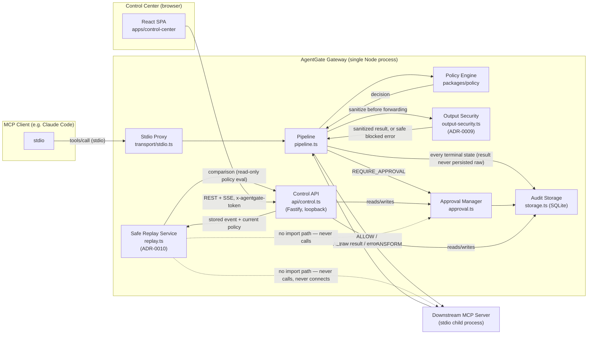
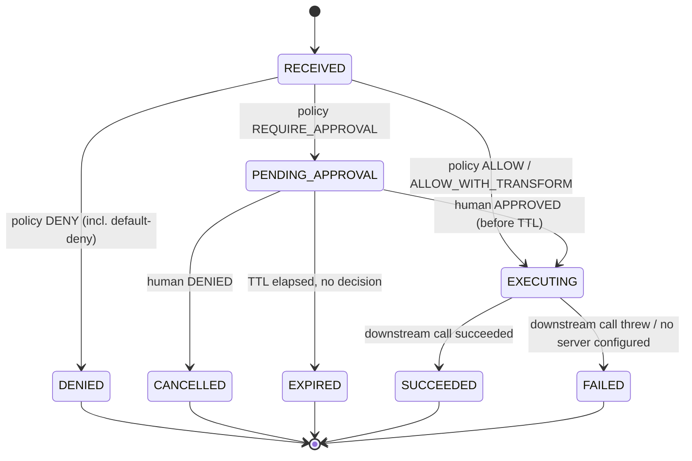
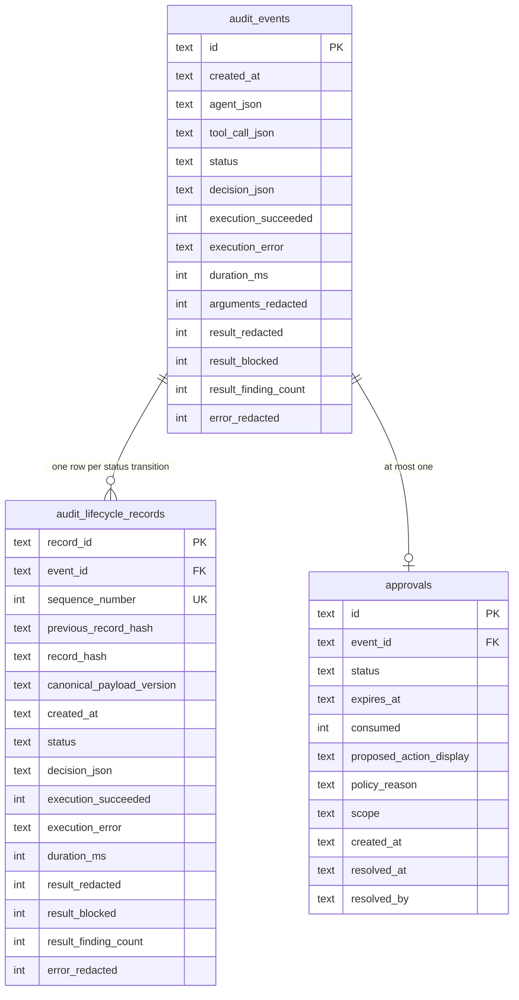
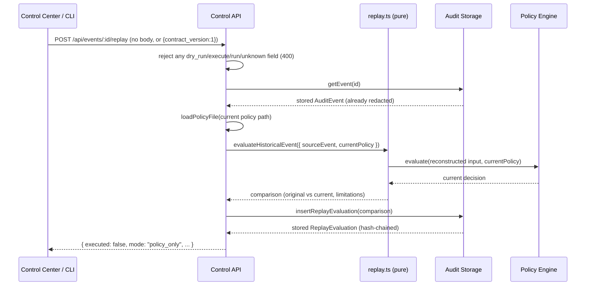
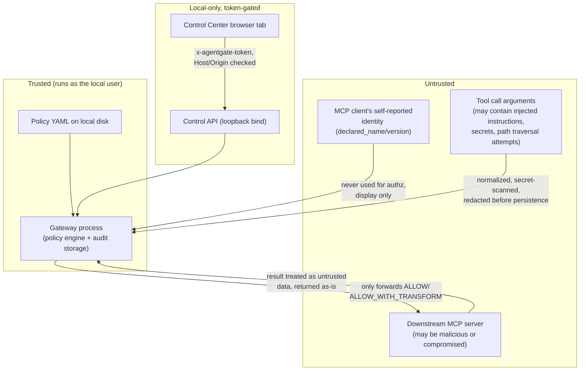

# Architecture

This document describes AgentGate as implemented today. Every diagram is drawn from the code cited beside it —
where the two disagree, the code is correct and this file is stale; please file an issue.

## Components

| Component | Responsibility | Code |
|---|---|---|
| **Stdio proxy** | Speaks MCP to the upstream client (e.g. Claude Code) as a *server*, and to the downstream MCP server as a *client*. Intercepts every `tools/call`. | `packages/gateway/src/transport/stdio.ts` |
| **Pipeline** | Normalizes arguments, redacts for audit, evaluates policy, executes (or blocks), sanitizes the downstream result/error, records the terminal event. Never throws — errors become `FAILED` audit events. | `packages/gateway/src/pipeline.ts` |
| **Output security** | Sanitizes downstream MCP results (text/structured/resource content) before they cross back to the upstream client; opaque binary content passes through untouched (ADR-0009). | `packages/gateway/src/output-security.ts` |
| **Policy engine** | Parses/validates policy YAML (Zod schema), evaluates first-match rules, normalizes paths, detects secrets. Also home to the shared deep-JSON sanitizer and canonical error sanitizer reused by output security. | `packages/policy/src/{schema,engine,transformation,output-sanitization,index}.ts` |
| **Downstream registry** | Parses gateway config, resolves which configured downstream server owns a given tool name. | `packages/gateway/src/config/registry.ts` |
| **Approval manager** | Creates/approves/denies/expires human-in-the-loop approvals; single-use; TTL-bound; polling-based expiry (10s interval). | `packages/gateway/src/approval.ts` |
| **Audit storage** | SQLite-backed, hash-chained, append-only audit log plus approvals/agents/replay-evaluation tables. Lifecycle records carry a `canonical_payload_version` (`'1'` pre-Milestone-3, `'2'` since ADR-0009) so hash verification dispatches on each record's own version. | `packages/gateway/src/storage.ts` |
| **Safe Replay service** | Pure function: re-evaluates a historical event's stored, redacted representation against the current policy. Imports only the policy engine and three tiny argument-extraction helpers — structurally cannot reach a downstream server, `executeDownstream()`, `runPipeline()`, or `ApprovalManager` (ADR-0010). | `packages/gateway/src/replay.ts` |
| **Control API** | Loopback-only Fastify REST + SSE API behind a per-launch random token. | `packages/gateway/src/api/control.ts` |
| **Control Center** | React/Vite SPA consuming the Control API. | `apps/control-center/src/**` |
| **Protocol package** | Shared TypeScript types for events, decisions, and the Control API contract, including the Safe Replay request/response contract — the only cross-package dependency all three consumers share. | `packages/protocol/src/{events,api}.ts` |
| **CLI** | `agentgate start`/`validate`/`audit verify`/`replay`/`init`/`config validate`/`doctor`/`integrate`/`smoke-test`. | `packages/gateway/src/cli.ts` |
| **Onboarding CLI modules** (Milestone 5) | Pure, testable logic behind the five onboarding commands — project scaffolding, config/policy validation (reusing the production loaders), read-only diagnostics, client-integration snippet generation, and a self-contained smoke test. | `packages/gateway/src/onboarding/{init,configValidate,doctor,integrate,smokeTest}.ts` |

## System diagram



## End-to-end tool-call sequence

```mermaid
sequenceDiagram
    participant Agent as MCP Client
    participant Proxy as Stdio Proxy
    participant Pipe as Pipeline
    participant Policy as Policy Engine
    participant OutSec as Output Security
    participant Audit as Audit Storage
    participant Down as Downstream Server

    Agent->>Proxy: tools/call "network.request" {url, body}
    Proxy->>Pipe: runPipeline(toolName, rawArgs, agent)
    Pipe->>Pipe: normalize path args (if present)
    Pipe->>Audit: insertEvent(status=RECEIVED)
    Pipe->>Policy: evaluate(policy, input)
    Policy-->>Pipe: decision (ALLOW / DENY / REQUIRE_APPROVAL / ALLOW_WITH_TRANSFORM)

    alt DENY
        Pipe->>Audit: updateEventStatus(DENIED) — appends a new lifecycle record
        Pipe-->>Proxy: {isError: true, text: "[AgentGate] Denied by rule ..."}
    else REQUIRE_APPROVAL
        Pipe->>Audit: updateEventStatus(PENDING_APPROVAL)
        Pipe->>Pipe: create Approval (TTL), poll storage every 500ms until resolved/expired
        Note over Pipe: Control Center approves/denies via Control API in the meantime
        Pipe->>Audit: updateEventStatus(EXPIRED | CANCELLED) if not approved
    else ALLOW / ALLOW_WITH_TRANSFORM (or approved)
        Pipe->>Down: spawn stdio client, callTool(toolName, args)
        alt downstream succeeds
            Down-->>Pipe: raw result
            Pipe->>OutSec: sanitizeToolResult(result, output_security config)
            Note over OutSec: text/structured/resource-text scanned;<br/>image/audio/blob passed through opaque
            OutSec-->>Pipe: sanitized result (or safe blocked-result error)
            Pipe->>Audit: updateEventStatus(SUCCEEDED, result_redacted/result_blocked/result_finding_count)
            Pipe-->>Proxy: sanitized result — the raw result is never persisted, in either mode
        else downstream throws
            Down-->>Pipe: raw error
            Pipe->>Pipe: sanitizeErrorMessage(err, source=downstream) — never logged/stored raw
            Pipe->>Audit: updateEventStatus(FAILED, execution_error=sanitized, error_redacted)
            Pipe-->>Proxy: {isError: true, text: "[AgentGate] " + sanitized execution_error}
        end
    end

    Proxy-->>Agent: MCP response
```

Every branch appends to the audit chain — even `DENIED` and `EXPIRED` calls are recorded, never silently dropped.

## Allow / deny / approval lifecycle



`RECEIVED`/`NORMALIZED`/`EVALUATED`/`ALLOWED`/`ALLOWED_WITH_TRANSFORM` are additional `AuditEventStatus` values
defined in `packages/protocol/src/events.ts` for forward compatibility; the current pipeline (`pipeline.ts`) moves
directly from `RECEIVED` to a terminal state without persisting every intermediate status as a separate event —
only `RECEIVED` and the final state are written for the ALLOW path today.

## Audit lifecycle data model

Two tables, by design (see [ADR-0004](AI_DECISIONS.md)):



- `audit_events` is a **mutable projection** — `UPDATE`d in place so the API can cheaply read "the current state of
  event X" — but every state transition is *also* appended as an immutable row in `audit_lifecycle_records`
  (`storage.ts` `appendLifecycleRecord()`), which is where the actual append-only guarantee lives.
- **Canonical payload versioning (ADR-0009).** Every lifecycle record stores the `canonical_payload_version` used
  to compute its own `record_hash`:
  - `'1'` (Milestone 1/2): `sha256(canonicalize({record_id, event_id, sequence_number, previous_record_hash,
    created_at, status, decision_type, execution_succeeded, execution_error, duration_ms, agent_session_id, tool,
    normalized_arguments}))`.
  - `'2'` (Milestone 3, current — every new record is written this way): the same payload plus
    `{result_redacted, result_blocked, result_finding_count, error_redacted}`.
  `canonicalize()` recursively sorts object keys before stringifying so the hash is stable regardless of JS
  property-insertion order. Adding the new fields to a *new* version rather than silently changing what `'1'`
  means is what lets a database created before this migration keep verifying correctly afterward.
- `AuditStorage.verifyChain()` re-walks every `audit_lifecycle_records` row in `sequence_number` order, checks the
  sequence has no gaps, reconstructs the canonical payload **using that row's own stored `canonical_payload_version`**
  (`buildCanonicalPayload()`), recomputes the hash, and fails on the first mismatch — so a chain that began under
  `'1'` and continues under `'2'` after an upgrade verifies correctly across the boundary, and tampering with a
  `'2'`-only field (e.g. flipping `result_finding_count` directly in the database) is still detected. This is what
  `agentgate audit verify` and both demos call.
- **Schema migration**: the `result_blocked`/`result_finding_count`/`error_redacted` columns (plus
  `result_redacted` on `audit_lifecycle_records`, which previously existed only on the `audit_events` projection)
  are added via `ALTER TABLE ... ADD COLUMN ... DEFAULT 0`, appended as the *last* entry in `storage.ts`'s
  `MIGRATIONS` array — never inserted earlier, since the migration runner resumes from the database's own
  recorded `schema_version` (an array index), and inserting a migration mid-array would silently renumber every
  migration after it and cause an already-upgraded database to skip the new one entirely. Existing rows default
  to `0`/false, which is historically accurate — they genuinely predate this feature.

## Safe Replay (ADR-0010)

Safe Replay re-evaluates a historical, already-redacted `AuditEvent` against the policy loaded from disk *right
now* and reports whether the decision would change. It is a pure function plus one append-only write — never a
second execution path.



- **`replay.ts` depends on exactly two things**: the same pure `evaluate()` function from `@agentgate/policy`
  that `runPipeline()` itself calls (one rule matcher, not a second copy), and three tiny, already-existing pure
  argument-extraction helpers re-exported from `pipeline.ts`. It never imports the MCP SDK,
  `executeDownstream()`, `runPipeline()`, or `ApprovalManager` — enforced by a dedicated structural test
  (`packages/gateway/tests/replay-no-execution.test.ts`) that inspects `replay.ts`'s own import statements, not
  just its runtime behavior.
- **Input reconstruction uses only what is already stored**: the same redacted `tool_call.normalized_arguments`
  `pipeline.ts` itself persists (`normalizePath()` is re-applied — idempotent and safe — but nothing is
  re-fetched or decrypted). There is no raw-argument store to read from in the first place.
- **`replay_evaluations` is a separate, append-only, hash-chained table** — not folded into
  `audit_events`/`audit_lifecycle_records` — because a replay evaluation has no mutable "current state"
  projection to maintain, unlike a live tool call's lifecycle:

  ```mermaid
  erDiagram
      replay_evaluations {
          text id PK
          text source_event_id FK
          int sequence_number UK
          text previous_replay_hash
          text replay_hash
          text canonical_payload_version
          text evaluated_at
          text policy_digest
          text original_decision_type
          text original_rule_id
          text original_reason_code
          text current_decision_type
          text current_rule_id
          text current_reason_code
          text current_explanation
          text current_transformations_json
          int decision_changed
          int matched_rule_changed
          int reason_code_changed
          int source_arguments_redacted
          text limitations_json
      }
      audit_events ||--o{ replay_evaluations : "zero or more evaluations"
  ```

  No column stores a raw argument, a raw result, or a raw secret — only decision types, rule IDs, reason codes, a
  policy digest, and bounded limitation strings. `AuditStorage.verifyReplayChain()` mirrors `verifyChain()`'s
  approach exactly (sequence-gap and hash-mismatch detection) and is called by `agentgate audit verify` alongside
  the audit chain, in the same invocation.
- **`policy_digest`** (`packages/policy/src/digest.ts`) is a SHA-256 hash of the *canonicalized policy
  structure* (never raw file bytes), sliced to 16 hex characters — recorded so a later reviewer can confirm which
  policy version a given replay used, without needing to reconstruct or store the full policy file itself.
- **A source event with no recorded original decision, or a legacy/malformed `tool_call` shape** (missing tool
  name, malformed `normalized_arguments`, missing agent) is rejected with `ReplayUnsupportedEventError` — surfaced
  as a `409` by the API and a non-zero exit by the CLI — rather than guessed at.
- **A missing or malformed current policy file fails closed** — `evaluateHistoricalEvent()` reuses the same
  `loadPolicyFile()` every other code path uses, which already throws a structured error; there is no silent
  default-allow and no stale cached policy.
- **Multiple evaluations of the same event are expected, not an error**: re-running replay after a further policy
  edit simply appends another row to the same event's lineage (`GET /api/events/:id/replays` lists all of them,
  newest last), each independently hash-chained.

See [ADR-0010](AI_DECISIONS.md) for the full decision record and
[`docs/THREAT_MODEL.md`](THREAT_MODEL.md#safe-replay-adr-0010) for the threats this design addresses.

## Output security configuration

`output_security` (`packages/gateway/src/config/registry.ts`, `OutputSecuritySchema`) is a **gateway-level**
config block, deliberately separate from policy rules — it is not a per-rule `allow_with_transform` variant, and
applies uniformly to every downstream result regardless of which policy rule allowed the call:

```yaml
output_security:
  mode: redact            # redact | block
  opaque_content: allow_uninspected   # the only implemented value — see below
  max_depth: 8             # object/array nesting actually inspected
  max_text_bytes: 1000000  # per-string-leaf scan limit
```

- **`mode: redact`** (default): recognized secrets in inspectable content are replaced with `[REDACTED]`; the
  result is still delivered.
- **`mode: block`**: if a secret is detected, or a depth/size limit prevented full inspection of otherwise-
  inspectable text/structured content, the entire result is replaced with a protocol-valid AgentGate error.
  Opaque binary content and unrecognized content types never trigger a block on their own in either mode — see
  [`docs/POLICY_REFERENCE.md`](POLICY_REFERENCE.md#output-security-gateway-level) for the full field reference
  and worked examples.
- Every setting is Zod-validated; `loadGatewayConfig()` rejects a malformed `output_security` block the same way
  it rejects any other invalid config field.

## Trust boundaries



The gateway process itself runs with the same OS privileges as the user who started it — AgentGate is a policy and
audit layer, not a sandbox. It cannot stop a downstream server from doing something outside the tool-call interface
it exposes.

## Local API boundary

The Control API (`packages/gateway/src/api/control.ts`) is defensive-in-depth for a *local, single-user* tool, not
a general-purpose auth system:

1. **Bind**: `127.0.0.1` only (`server.ts` `controlApp.listen({ host: '127.0.0.1' })`) — never `0.0.0.0`.
2. **Host header allowlist**: only `localhost` / `127.0.0.1` / `[::1]` / `::1` accepted; anything else → `403`.
3. **Origin allowlist** (when present): same loopback set, else `403` — defends against a malicious page in another
   browser tab issuing cross-origin requests (a DNS-rebinding-style attack still needs a `Host` header AgentGate
   trusts, which is why the Host check exists independently of Origin).
4. **CORS**: `@fastify/cors` restricted to the Vite dev server origins (`http://127.0.0.1:5173`,
   `http://localhost:5173`).
5. **Token**: a fresh 32-byte random hex token per gateway launch, required as `x-agentgate-token` on every request
   except the SSE stream, which accepts it as a `?token=` query parameter (`EventSource` cannot set custom headers).
6. **`Referrer-Policy: no-referrer`** on every response.
7. **Confused-deputy check** on approve: the request body's `event_id` must match the approval's actual `event_id`
   before an approval can be granted.

See [`docs/THREAT_MODEL.md`](THREAT_MODEL.md) for what this boundary does *not* cover (e.g. the SSE token appearing
in browser history/logs, since it must be a query parameter).

## Failure modes

- **Malformed policy file**: `loadPolicyFile()`/`validatePolicy()` throw with structured errors. `runPipeline()`
  calls `loadPolicyFile()` *before* it records the `RECEIVED` audit event and does not catch the throw itself —
  the call is neither recorded nor safely denied at the pipeline level; it propagates to the MCP SDK's own request
  handler, which converts it into a generic JSON-RPC error back to the client. There is no audit record and no
  `MALFORMED_POLICY` decision produced for this path today, despite `ReasonCode` defining one. Documented as a
  known gap in [`docs/THREAT_MODEL.md`](THREAT_MODEL.md).
- **Downstream server unreachable/crashes**: `executeDownstream()` catches the error and the event is recorded as
  `FAILED` with a sanitized error message — `sanitizeErrorMessage()` (`packages/policy/src/output-sanitization.ts`,
  ADR-0009) redacts recognized secret patterns, bounds the length, and normalizes control characters *before* the
  message is ever assigned to `execution_error`, so the untrusted downstream error never reaches storage/logs raw.
  See [`docs/THREAT_MODEL.md`](THREAT_MODEL.md#log-and-audit-poisoning) for what this does and does not cover.
- **No downstream server configured for a tool**: recorded as `FAILED` with an explicit error, not silently
  dropped.
- **Approval never answered**: expires at TTL, recorded as `EXPIRED`, single background sweep
  (`ApprovalManager.expireStale()`, every 10s) also marks stale `PENDING` rows `EXPIRED` independently of any
  in-flight `runPipeline()` call.
- **Gateway process killed mid-call**: SQLite writes inside `appendLifecycleRecord()` are wrapped in a
  `this.db.transaction()`, so a crash mid-write cannot leave a partially-written lifecycle record; a call in
  flight simply never reaches a terminal audit state.
- **Malformed policy file at replay time** (ADR-0010): unlike the live pipeline path above, this *is* caught —
  `evaluateHistoricalEvent()`'s `loadPolicyFile()` failure propagates up to a handled `catch` in both the Control
  API route (`500`, sanitized message) and the CLI (`non-zero exit`, sanitized message). Replay fails closed
  explicitly rather than silently defaulting to allow or serving a stale cached policy.
- **Historical event with no recorded decision or a legacy/malformed shape** (ADR-0010): rejected with
  `ReplayUnsupportedEventError` (`409` / non-zero exit) rather than guessed at — see
  [Safe Replay](#safe-replay-adr-0010) above.

## Onboarding CLI (Milestone 5)

Five commands — `init`, `config validate`, `doctor`, `integrate`, `smoke-test` — add adoption convenience without
adding any new execution or trust surface. `agentgate start` remains the only command that ever executes anything.

- **`config validate` and `doctor` never duplicate validation logic.** Both call `loadGatewayConfig()`/
  `loadPolicyFile()` directly (`packages/gateway/src/onboarding/configValidate.ts`) — the same functions
  `agentgate start` itself calls.
- **`doctor` is read-only by construction for its hardest case, the audit chain.** `AuditStorage`'s constructor
  applies any pending schema migration unconditionally on open — a write. `doctor` therefore first calls
  `readSchemaVersionReadOnly()` (`packages/gateway/src/storage.ts`), which opens the database file with
  `better-sqlite3`'s `readonly: true` OS-level flag purely to read `schema_version`. Only when that confirms the
  schema is already fully current (so the migration loop inside `AuditStorage`'s constructor is guaranteed to be
  a no-op) does `doctor` construct a live `AuditStorage`, to reuse the real `verifyChain()`/`verifyReplayChain()`
  rather than a second hand-rolled verifier. A behind-schema database is reported as `WARN`, never silently
  migrated by `doctor` itself.
- **`smoke-test` uses its own fixture, not the test suite's.** `packages/gateway/src/onboarding/
  smokeFixtureServer.mjs` is deliberately plain JavaScript (not compiled TypeScript) so it works identically
  whether AgentGate is running from `src/` (Vitest, no build required) or from `dist/` (an installed package —
  `tests/` is never shipped). `packages/gateway/scripts/copy-assets.mjs`, wired into `pnpm run build` as `tsc &&
  node scripts/copy-assets.mjs`, is the one place non-TypeScript runtime assets are copied into `dist/`, since
  `tsc` itself does not touch non-`.ts` files under `src/`.
- **`integrate`'s default behavior only ever prints a snippet or writes a new, explicitly-named file.** Direct
  mutation of a real client config file requires an explicit `--apply <path>` opt-in
  (`packages/gateway/src/onboarding/integrate.ts`, `applyIntegration()`), which always backs up the original,
  writes atomically (temp file + rename), and merges into (rather than replaces) the existing JSON, preserving
  every unrelated top-level key and every unrelated `mcpServers` entry.

## Extension points

- **New downstream transport**: `DownstreamServerSchema` in `config/registry.ts` already has an `HttpServerSchema`
  branch; `pipeline.ts` `executeDownstream()` would need an HTTP-client branch to actually use it (see
  [Protocol limitations](#protocol-limitations)).
- **New policy match fields**: add to `PolicyRuleSchema` (`packages/policy/src/schema.ts`) and to `ruleMatches()`
  (`packages/policy/src/engine.ts`); both are small, well-isolated functions.
- **New secret pattern**: append a `RegExp` to `SECRET_PATTERNS` in `packages/policy/src/transformation.ts` — this
  single list backs inbound-argument redaction, outbound-result sanitization, and error sanitization, so a new
  pattern strengthens all three at once (ADR-0009).
- **A bounded, type-aware binary scanner**: `sanitizeToolResult()` (`packages/gateway/src/output-security.ts`)
  currently treats all `image`/`audio`/`resource.blob` content as opaque; a future scanner would plug in where
  those content-block cases are handled, and `output_security.opaque_content` would gain a second valid value.
- **New Control API endpoint**: add a route in `buildControlApi()`; the `onRequest` hook already applies
  Host/Origin/token checks to every route registered afterward.

## Protocol limitations

- Only **legacy 2025-era MCP over stdio** is implemented end-to-end, on both the upstream (client-facing) and
  downstream (server-facing) sides — see [ADR-0005](AI_DECISIONS.md). `McpEra` already models a `'modern-2026-07-28'`
  value in `packages/protocol/src/events.ts`, but the pipeline hardcodes `'legacy-2025'`
  (`packages/gateway/src/transport/stdio.ts`).
- Downstream tool **discovery** connects a short-lived MCP client to the first configured stdio server and calls
  `listTools()`; if that server is unreachable at gateway startup, the proxy still starts but advertises an empty
  tool list upstream (tool calls by name still work — the pipeline does not consult the discovered list before
  evaluating a call).
- Each downstream tool call spawns a **fresh stdio client connection** rather than reusing a pooled one
  (`executeDownstream()` — explicitly noted in-code as a Milestone 1 simplification).
